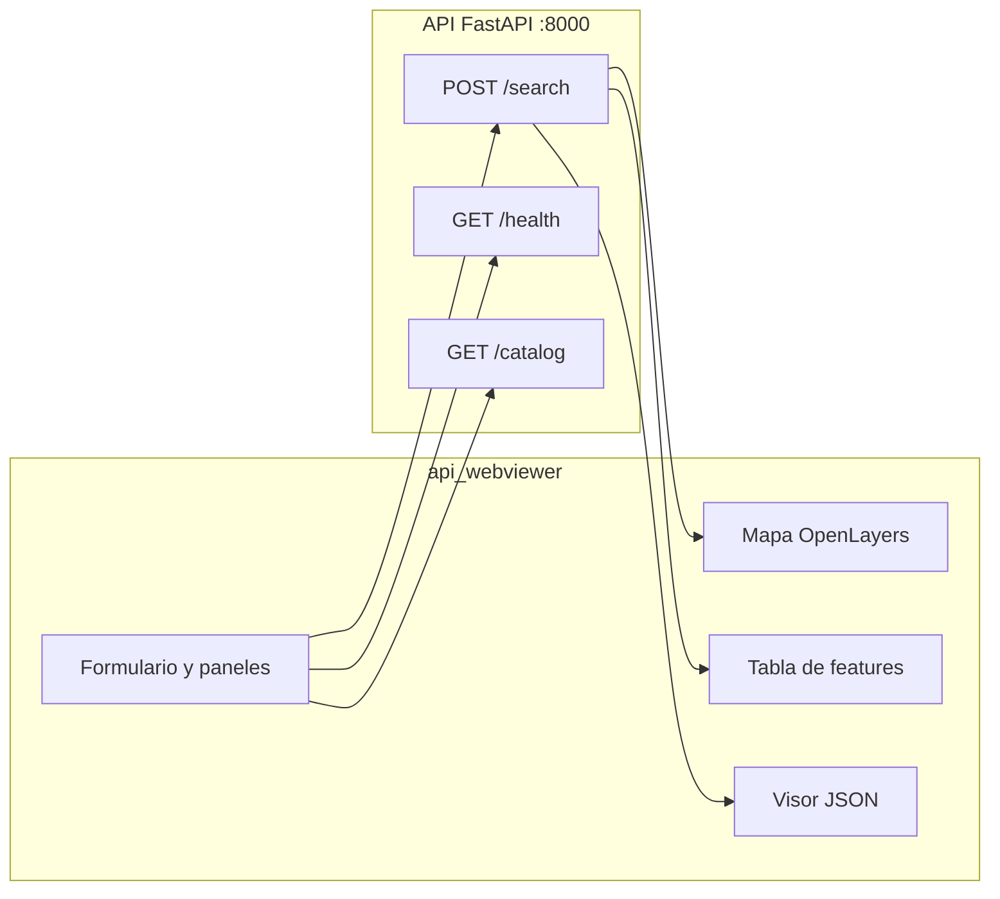

# Plan: Interfaz web `api_webviewer`

## Contexto

La API en [`api/`](D:\TFM\yolo_example\api) expone tres endpoints relevantes:

| Método | Ruta | Uso |
|--------|------|-----|
| `POST` | `/search` | Búsqueda semántica; body: `query`, `top_k`, `per_layer_limit`, `min_confidence` |
| `GET` | `/catalog` | Lista de capas disponibles |
| `GET` | `/health` | Estado del servicio y BBDD |

La respuesta de `/search` es un **GeoJSON FeatureCollection** con metadatos embebidos (ver [`geojson_serializer.py`](D:\TFM\yolo_example\api\infrastructure\geo\geojson_serializer.py)):

```json
{
  "type": "FeatureCollection",
  "crs": { "type": "name", "properties": { "name": "EPSG:3857" } },
  "features": [{ "geometry": {...}, "properties": { "layer", "similarity", "clase_yolo", ... } }],
  "metadata": { "query", "detected_language", "structured_query", "total_features", "layers_searched" }
}
```

CORS ya está habilitado con `allow_origins=["*"]` en [`api/main.py`](D:\TFM\yolo_example\api\main.py), por lo que el viewer puede llamar a la API desde otro origen (p. ej. `localhost:8080` → `localhost:8000`).

## Enfoque técnico

**Stack:** HTML + CSS + JavaScript vanilla, sin build step ni dependencias npm. OpenLayers v9 desde CDN (más reciente que el v7 usado en [`pruebas/tiles16/openlayers.html`](D:\TFM\yolo_example\pruebas\tiles16\openlayers.html)).

**Por qué estático:** cumple el requisito de "simple", cero configuración de bundler, y se puede servir con `python -m http.server`.



## Estructura de archivos

```
api_webviewer/
├── index.html       # Layout: header, formulario, paneles de resultados
├── css/
│   └── styles.css   # Layout responsive, estados loading/error
└── js/
    ├── api.js       # Cliente fetch: search, health, catalog
    ├── map.js       # Inicialización OpenLayers + capa vectorial GeoJSON
    └── app.js       # Orquestación UI, eventos, renderizado tabla/metadata
```

## Diseño de la interfaz

### Barra superior
- Campo **URL base de la API** (default `http://localhost:8000`), persistido en `localStorage`
- Badge de estado **Health** (verde/amarillo/rojo) con info de `database` y `clip_model`
- Botón "Comprobar conexión" que llama a `GET /health`

### Panel de búsqueda
- **Consulta** (input texto, obligatorio): ej. "piscinas", "cars"
- **Opciones avanzadas** (colapsables, con valores por defecto de [`config.py`](D:\TFM\yolo_example\api\config.py)):
  - `top_k` (default 50, rango 1–500)
  - `per_layer_limit` (default 100, rango 1–2000)
  - `min_confidence` (default 0.0, rango 0–1)
- Botón **Buscar** con spinner durante la petición
- Chips de ejemplo rápido: "piscinas", "coches", "buildings"

### Panel de resultados (visible tras búsqueda exitosa)

**Resumen de metadata** (desde `response.metadata`):
- Idioma detectado, clases YOLO candidatas, capas consultadas, total de features
- `structured_query.reasoning` en texto colapsable

**Tres vistas con pestañas:**

1. **Mapa** — OpenLayers con:
   - Base OSM
   - Capa vectorial con polígonos coloreados por `similarity` (gradiente verde→rojo)
   - Popup al clic: `clase_yolo`, `similarity`, `confianza`, `layer`, `tile_id`
   - `fit` automático al extent de los resultados
   - Proyección: leer GeoJSON en `EPSG:3857` (como indica el CRS de la respuesta)

2. **Tabla** — filas con columnas: `#`, `clase_yolo`, `similarity`, `confianza`, `layer`, `tile_id`; ordenable por `similarity` descendente

3. **JSON** — respuesta completa formateada (`JSON.stringify` con indent), con botón "Copiar"

### Manejo de errores
- `400`: mostrar `detail` del API (consulta inválida / sin candidatos clase)
- `503`: analizador LLM no disponible
- `500` / red: mensaje claro en banner rojo
- Estado vacío: "0 detecciones encontradas" sin error

### Panel lateral opcional: Catálogo
- Al cargar la página (o bajo demanda), `GET /catalog` muestra lista de capas (`nombre_capa`, `cog_url`) para contexto

## Detalles de implementación clave

### Cliente API (`api.js`)

```javascript
async function searchDetections(baseUrl, { query, top_k, per_layer_limit, min_confidence }) {
  const body = { query };
  if (top_k != null) body.top_k = top_k;
  // ... solo enviar opcionales si el usuario las modificó
  const res = await fetch(`${baseUrl}/search`, {
    method: 'POST',
    headers: { 'Content-Type': 'application/json' },
    body: JSON.stringify(body),
  });
  if (!res.ok) throw new ApiError(res.status, await res.json());
  return res.json();
}
```

### Mapa (`map.js`)
- `ol/format/GeoJSON` con `dataProjection: 'EPSG:3857'` y `featureProjection: 'EPSG:3857'`
- Estilo dinámico según `properties.similarity`
- Limpiar capa anterior en cada nueva búsqueda

### Persistencia
- `localStorage` para URL base de API
- Sin backend propio del viewer

## Cómo ejecutar (documentado en comentario al inicio de `index.html`)

Terminal 1 — API:
```bash
cd api
.venv\Scripts\activate
uvicorn main:app --reload --port 8000
```

Terminal 2 — Viewer:
```bash
cd api_webviewer
python -m http.server 8080
```

Abrir `http://localhost:8080` en el navegador.

## Fuera de alcance

- Autenticación, proxy reverso integrado, o empaquetado Docker
- Frameworks React/Vue o TypeScript
- Edición manual del body JSON (solo formulario tipado)
- Carga de capas COG del catálogo en el mapa (solo geometrías de detecciones)

## Verificación manual

1. Con API caída → badge health en rojo
2. `GET /health` OK → badge verde
3. Buscar "piscinas" → mapa con polígonos, metadata `detected_language: "es"`
4. Buscar "cars" → resultados con clases vehículo, `detected_language: "en"`
5. Consulta inválida → error 400 visible
6. Pestaña JSON muestra FeatureCollection completo
7. Cambiar URL base y recargar → persiste en localStorage
