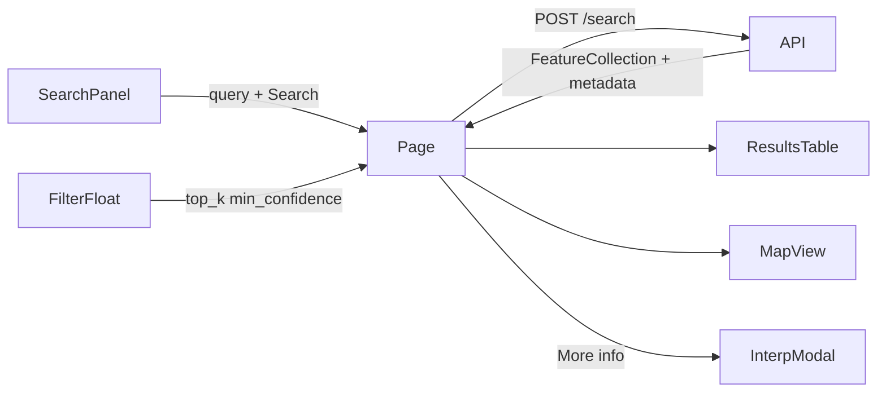

# Conectar search de la API al frontend

## Contexto

Hoy [`frontend/app/page.tsx`](frontend/app/page.tsx) llama a `runSemanticSearch` (mock en [`frontend/lib/search.ts`](frontend/lib/search.ts)). El cliente solo tiene `apiGet` ([`frontend/lib/api/client.ts`](frontend/lib/api/client.ts)); health y catálogo ya van contra la API real.

Contrato backend: **`POST /search`** con `{ query, top_k, min_confidence?, ... }` → GeoJSON FeatureCollection EPSG:3857 + `metadata.interpretation` (ver [`api/api/schemas/search.py`](api/api/schemas/search.py) y serializer).

## Decisiones de UX (fijadas)

| Tema | Decisión |
|------|----------|
| Columnas tabla | **ID**, **Clase** (`clase_yolo`), **Confianza** (`confianza`), **capa** (`layer`) |
| More info | **Un botón** junto al encabezado de resultados → modal con interpretación de la búsqueda (no JSON) |
| Filtros | Flotante en el mapa **debajo** de [`CatalogLayerControl`](frontend/components/ares/catalog-layer-control.tsx): slider `top_k` + toggles clustering / filtrar baja confianza |
| Panel izquierdo | Brand, query, ejemplos, botón buscar, error, lista de resultados + More info |
| JSON | No se renderiza en ningún sitio |
| Clustering | El toggle se mueve al flotante; **sigue sin efecto en el mapa** en este plan (no implementar cluster OL aún) |
| Baja confianza | Con toggle ON enviar `min_confidence: 0.7`; OFF → `0.0` (filtro en servidor, no post-filtro client) |

## 1. Cliente API y tipos

- Extender [`frontend/lib/api/client.ts`](frontend/lib/api/client.ts) con `apiPost<T>(path, body, options)` (mismo timeout/abort/`ApiError` que `apiGet`).
- Timeout de search **más largo** (p. ej. 60s): Ollama puede tardar.
- Añadir [`frontend/lib/api/search.ts`](frontend/lib/api/search.ts): `searchDetections({ query, top_k, min_confidence })` → `POST /search`.
- Tipos en [`frontend/lib/api/types.ts`](frontend/lib/api/types.ts):
  - `SearchRequest`, `SearchFeatureCollection`, feature `properties` (`layer`, `clase_yolo`, `confianza`, `similarity`, `distance_to_reference_m?`, …)
  - `SearchMetadata`, `Interpretation` (`summary_es`/`summary_en`, `intent`, `target`, `reference?`, `relation`, `distance_m`, `embedding_text`, `source`, …), `timings`, `warnings`, `reference_features?`
- Mapper `featureToSearchResult` → tipo de fila UI (reemplaza el mock): `{ id, claseYolo, confianza, layer, lng, lat }` desde `feature.id` + properties + centroide/punto de `geometry` (coords ya 3857; el mapa ya trabaja en 3857).
- Eliminar o vaciar el mock [`frontend/lib/search.ts`](frontend/lib/search.ts) (solo tipos/helpers si hace falta).

## 2. Orquestación en `page.tsx`

- Estado: `rawResponse` / `results` + `metadata` (para el modal); `searchError`; `AbortController` al re-buscar o desmontar.
- `handleSearch`: si query vacía o API offline, no llamar; `apiPost` con `top_k: count` y `min_confidence` según toggle; actualizar resultados, `hasSearched`, selección.
- Quitar `setTimeout` + `runSemanticSearch`.
- Pasar `results` al mapa como ahora (marcadores desde geometría real).
- **Referencias espaciales** (si `metadata.reference_features`): capa OL distinta en [`map-view.tsx`](frontend/components/ares/map-view.tsx) (estilo distinto al de detecciones), sin UI de JSON.

## 3. Tabla de resultados

Reescribir [`frontend/components/ares/results-table.tsx`](frontend/components/ares/results-table.tsx):

- Columnas: ID | Clase | Confianza | capa
- Confianza formateada (p. ej. `%` o `0.xx`); click en fila → `onSelect` + fly en mapa (comportamiento actual).
- Cabecera con botón **More info** (disabled si no hay `metadata` tras búsqueda).

## 4. Modal de interpretación

- Añadir Dialog shadcn (estilo `base-nova` del proyecto) en `components/ui/dialog.tsx`.
- Nuevo [`frontend/components/ares/interpretation-modal.tsx`](frontend/components/ares/interpretation-modal.tsx) con campos legibles (i18n), inspirado en el viewer legacy (`renderMetadata` en `api_webviewer/js/app.js`):
  - Resumen (`summary_es` / `summary_en`)
  - Consulta, idioma detectado, intent, source (`parser` / `llm` / `override`)
  - Target (label / clases YOLO); si espacial: reference, relation, distance_m, embedding_text
  - Totales: `total_features`, `layers_searched`
  - Timings (`llm_ms`, `clip_ms`, `database_ms`, `total_ms`)
  - Warnings si hay
- **Sin** textarea/pre del GeoJSON ni `structured_query` crudo.

## 5. Flotante de filtros en el mapa

- Nuevo [`frontend/components/ares/search-filters-control.tsx`](frontend/components/ares/search-filters-control.tsx): mismo lenguaje visual que catálogo (`w-64`, `rounded-lg border bg-card shadow-md`).
- Contenido: título “Filtros”, slider nº resultados (20–100), toggles clustering + baja confianza.
- En [`page.tsx`](frontend/app/page.tsx), en la columna derecha `absolute right-4 top-4`, **debajo** de `CatalogLayerControl` (mismo `flex-col gap-2`).
- Quitar slider + toggles de [`search-panel.tsx`](frontend/components/ares/search-panel.tsx); el panel izquierdo queda más limpio: query → buscar → resultados.

## 6. i18n

Actualizar [`frontend/lib/i18n/locales/es.json`](frontend/lib/i18n/locales/es.json) y [`en.json`](frontend/lib/i18n/locales/en.json):

- `results.id`, `results.class`, `results.confidence`, `results.layer`, `results.moreInfo`
- `interpretation.*` (títulos de campos del modal)
- `map.filters` (título del flotante)
- `search.error` / mensajes de fallo de búsqueda
- Ajustar claves obsoletas de coordenadas/score/feature si dejan de usarse

## 7. Fuera de alcance (este plan)

- Historial localStorage (plan aparte ya documentado)
- Overrides espaciales en UI (`target` / `reference` / distancia manual)
- Clustering real en OpenLayers
- Columna distancia / filtros post-respuesta por clase/similarity como el webviewer legacy
- Cambios en la API Python

## Archivos principales a tocar

- [`frontend/lib/api/client.ts`](frontend/lib/api/client.ts), `types.ts`, nuevo `search.ts`
- [`frontend/app/page.tsx`](frontend/app/page.tsx)
- [`frontend/components/ares/search-panel.tsx`](frontend/components/ares/search-panel.tsx)
- [`frontend/components/ares/results-table.tsx`](frontend/components/ares/results-table.tsx)
- Nuevos: `interpretation-modal.tsx`, `search-filters-control.tsx`, `components/ui/dialog.tsx`
- [`frontend/components/ares/map-view.tsx`](frontend/components/ares/map-view.tsx) (geometría real + referencias)
- Locales `es.json` / `en.json`
- Retirar mock de búsqueda
