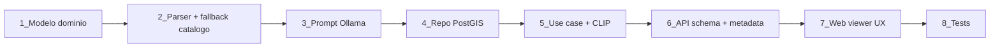

# Plan: Consulta espacial enriquecida + CLIP + UX transparente

## Problema actual

El flujo en [`api/application/use_cases/search_detections.py`](api/application/use_cases/search_detections.py) solo admite `intent == "search_class"` y delega en [`PostgresDetectionRepository.search_hybrid`](api/infrastructure/db/postgres_detection_repository.py) un filtro por clase + ranking CLIP, sin operadores espaciales.

Para `"coches cerca de una rotonda"`:

- [`apply_catalog_fallback`](api/infrastructure/ai/yolo_class_catalog.py) prioriza `find_catalog_entry(query)` completo → `"rotonda"` gana a `"coches"` por longitud de subcadena.
- `"cerca"` está en `STOP_WORDS` y no se interpreta como relación.
- [`build_clip_embedding_text`](api/infrastructure/ai/attribute_catalog.py) embebe la frase entera si no hay color → refuerza la clase equivocada.

```mermaid
flowchart TB
    subgraph today [Estado actual]
        Q1[Consulta NL] --> LLM1[Ollama StructuredQuery]
        LLM1 --> FB1[Catalog fallback sobre query completa]
        FB1 --> HY1["search_hybrid(clase_yolo)"]
        HY1 --> OUT1[GeoJSON]
    end

    subgraph target [Estado objetivo]
        Q2[Consulta NL o params explicitos] --> LLM2[StructuredQuery enriquecido]
        LLM2 --> FB2[Fallback target/reference separados]
        FB2 --> BR{intent}
        BR -->|search_class| HY2[search_hybrid]
        BR -->|search_spatial| SP["search_spatial_near(ST_DWithin)"]
        HY2 --> CLIP[CLIP solo target+attrs]
        SP --> CLIP
        CLIP --> OUT2[GeoJSON + metadata interpretacion]
    end
```



---

## 1. Modelo de dominio enriquecido

**Archivo principal:** [`api/domain/value_objects/semantic_query.py`](api/domain/value_objects/semantic_query.py)

Extender `StructuredQuery` manteniendo compatibilidad hacia atrás:

```python
# Campos nuevos (resumen)
intent: Literal["search_class", "search_spatial", "search_attribute", "unknown"]
relation: Literal["near", "inside"] | None = None          # v1 implementa "near"
distance_m: float | None = None                            # override; default desde config

target_label: str | None = None
target_canonical_label: str | None = None
target_clase_yolo: list[str] = []

reference_label: str | None = None
reference_canonical_label: str | None = None
reference_clase_yolo: list[str] = []

# Compatibilidad (simple queries)
clase_yolo_candidates: list[str]   # = target_clase_yolo cuando hay target
canonical_label: str | None        # = target_canonical_label
object_label: str | None           # = target_label
```

**Reglas de compatibilidad:**
- Consultas simples (`"coches"`) siguen poblando `clase_yolo_candidates` como hoy.
- Consultas espaciales usan `intent=search_spatial` con `target_*` y `reference_*` poblados.
- Añadir helper de dominio `StructuredQuery.effective_target_classes()` para evitar duplicar lógica en use case y CLIP.

**Entidad de resultado:** extender [`Detection`](api/domain/entities/detection.py) con campos opcionales:
- `distance_to_reference_m: float | None`
- `reference_id: int | None` (id de la rotonda más cercana que satisface el filtro)

---

## 2. Parseo semántico (LLM + fallback determinista)

### 2.1 Prompt Ollama

**Archivo:** [`api/infrastructure/ai/ollama_query_analyzer.py`](api/infrastructure/ai/ollama_query_analyzer.py)

Ampliar `SYSTEM_PROMPT` con reglas explícitas:

| Patrón | intent | target | reference | relation |
|--------|--------|--------|-----------|----------|
| `"coches cerca de rotonda"` | `search_spatial` | vehicle | roundabout | near |
| `"cars near buildings"` | `search_spatial` | vehicle | building | near |
| `"coches rojos"` | `search_class` | vehicle + attrs | — | — |
| `"rotondas"` | `search_class` | roundabout | — | — |

Instrucciones clave para el LLM:
- En consultas `"X cerca de Y"`, **X es el target** (lo que se devuelve), **Y es la referencia** (ancla espacial).
- `reference_*` solo se rellena si hay relación espacial.
- `distance_m` null → el backend aplicará default.

### 2.2 Parser determinista de respaldo

**Nuevo módulo:** `api/infrastructure/ai/spatial_query_parser.py`

Regex/heurística bilingüe antes o después del LLM para patrones robustos:

```
(?P<target>.+?)\s+(cerca de|junto a|near|next to|close to)\s+(?P<reference>.+)
```

- Extrae fragmentos target/reference.
- Resuelve cada fragmento con `find_catalog_entry(fragment)` **por separado**, no sobre la query completa.
- Si el LLM devolvió `search_class` pero el parser detecta relación espacial → promover a `search_spatial`.

### 2.3 Corrección del catalog fallback

**Archivo:** [`api/infrastructure/ai/yolo_class_catalog.py`](api/infrastructure/ai/yolo_class_catalog.py)

Cambios en `apply_catalog_fallback`:

1. **No usar `find_catalog_entry(query)` como primera opción** en consultas compuestas; priorizar:
   - `structured.target_canonical_label` / `reference_canonical_label` (LLM)
   - Fragmentos del parser espacial
   - `structured.canonical_label` (legacy)
   - Query completa solo como último recurso
2. Crear `SPATIAL_STOP_WORDS` separado de `STOP_WORDS`: mantener `"cerca"`, `"near"`, `"junto"` fuera del stripping cuando van entre dos entidades.
3. Nueva función `resolve_spatial_query(structured, query) -> StructuredQuery` que mapea target/reference al catálogo de forma independiente.

---

## 3. Búsqueda espacial real en PostGIS

### 3.1 Contrato del repositorio

**Archivo:** [`api/domain/repositories/detection_repository.py`](api/domain/repositories/detection_repository.py)

Añadir método:

```python
async def search_spatial_near(
    *,
    layer_names: list[str],
    target_clase_yolo_list: list[str],
    reference_clase_yolo_list: list[str],
    query_embedding: list[float],
    distance_m: float,
    per_layer_limit: int,
    min_confidence: float,
) -> list[Detection]
```

### 3.2 SQL (por capa, self-join)

**Archivo:** [`api/infrastructure/db/postgres_detection_repository.py`](api/infrastructure/db/postgres_detection_repository.py)

Query parametrizada dentro de cada tabla de capa (EPSG:3857, unidades ~metros en Madrid):

```sql
SELECT DISTINCT ON (t.id)
    :layer_name AS layer,
    t.id, t.tile_id, t.clase_yolo, t.modelo_deteccion, t.confianza,
    ST_AsGeoJSON(t.geom) AS geom_json,
    1 - (t.embedding <=> CAST(:query_vec AS vector)) AS similarity,
    ST_Distance(t.geom, r.geom) AS distance_to_reference_m,
    r.id AS reference_id
FROM {table} t
JOIN {table} r
  ON r.clase_yolo = ANY(:reference_classes)
 AND ST_DWithin(t.geom, r.geom, :distance_m)
WHERE t.clase_yolo = ANY(:target_classes)
  AND t.confianza >= :min_conf
ORDER BY t.id, t.embedding <=> CAST(:query_vec AS vector)
```

Luego fusionar capas, ordenar globalmente por `similarity DESC`, truncar a `top_k`.

**Notas de implementación:**
- Usar `ST_DWithin` para filtrar (aprovecha índice GIST si existe).
- `DISTINCT ON (t.id)` evita duplicar un coche cercano a varias rotondas; conservar la referencia con menor distancia.
- Validar que `distance_m > 0`; acotar máximo (p. ej. 500 m) en config para evitar scans masivos.

### 3.3 Índice espacial (migración opcional)

Script SQL o verificación en startup/docs:

```sql
CREATE INDEX IF NOT EXISTS idx_{table}_geom ON {table} USING GIST (geom);
CREATE INDEX IF NOT EXISTS idx_{table}_clase_geom ON {table} (clase_yolo) INCLUDE (geom);
```

Documentar en README del API que las capas deben tener `geom GEOMETRY(Polygon, 3857)` (ya definido en el plan original).

### 3.4 Configuración

**Archivo:** [`api/config.py`](api/config.py)

```python
default_spatial_distance_m: float = 50.0
max_spatial_distance_m: float = 500.0
```

---

## 4. Caso de uso: bifurcación y ranking

**Archivo:** [`api/application/use_cases/search_detections.py`](api/application/use_cases/search_detections.py)

Flujo actualizado:

1. Analizar query → `StructuredQuery`.
2. Aplicar overrides explícitos del request (si vienen).
3. Validar según intent:
   - `search_class`: flujo actual (`search_hybrid`).
   - `search_spatial`: exigir `target_clase_yolo` + `reference_clase_yolo`; resolver `distance_m` (request > structured > config).
   - `unknown` / `search_attribute`: mensaje 400 descriptivo con sugerencia de reformular.
4. Construir embedding con nueva lógica CLIP (sección 5).
5. Invocar repositorio correspondiente.
6. Serializar con metadata enriquecida.

**Mensajes de error útiles (400):**
- `"No se identificó objeto de referencia espacial (ej. rotonda, edificio)."`
- `"La relación 'inside' aún no está soportada; use 'cerca de'."`

---

## 5. Mejoras en embedding CLIP

**Archivo:** [`api/infrastructure/ai/attribute_catalog.py`](api/infrastructure/ai/attribute_catalog.py)

Refactorizar `build_clip_embedding_text`:

| Escenario | Texto embebido |
|-----------|----------------|
| Con atributos de color | `"red vehicle"` (sin cambio) |
| `search_spatial` o `search_class` sin attrs | `"vehicle"` (canonical target) |
| Sin canonical resoluble | fallback al `target_label` normalizado, **nunca** la frase compuesta |

Nueva función auxiliar `build_target_embedding_text(structured) -> str` usada por el use case.

**Efecto:** `"coches cerca de rotonda"` → embed `"vehicle"`, no la frase completa.

---

## 6. API transparente

### 6.1 Request enriquecido (opcional, override)

**Archivo:** [`api/api/schemas/search.py`](api/api/schemas/search.py)

Extender `SearchRequest` con campos opcionales (no sustituyen `query`, lo complementan):

```python
spatial_relation: Literal["near"] | None = None
target: str | None = None           # canonical o sinónimo ES/EN
reference: str | None = None
spatial_distance_m: float | None = Field(default=None, ge=1, le=500)
```

**Archivos:** [`SearchRequestDTO`](api/application/dto/search_dto.py), [`SearchFilters`](api/domain/value_objects/search_filters.py) o nuevo `SpatialSearchParams` inmutable.

**Prioridad de resolución:** params explícitos > LLM > parser determinista > config defaults.

Documentar en OpenAPI (`/docs`) con ejemplos:
- NL: `{ "query": "coches cerca de rotonda" }`
- Explícito: `{ "query": "coches cerca de rotonda", "target": "vehicle", "reference": "roundabout", "spatial_distance_m": 30 }`

### 6.2 Response metadata enriquecida

**Archivo:** [`api/infrastructure/geo/geojson_serializer.py`](api/infrastructure/geo/geojson_serializer.py)

Ampliar bloque `metadata`:

```json
{
  "query": "coches cerca de una rotonda",
  "interpretation": {
    "summary_es": "Buscando coches a menos de 50 m de rotondas",
    "intent": "search_spatial",
    "target": { "label": "coches", "canonical": "vehicle", "clase_yolo": ["car", "..."] },
    "reference": { "label": "rotonda", "canonical": "roundabout", "clase_yolo": ["roundabout"] },
    "relation": "near",
    "distance_m": 50,
    "embedding_text": "vehicle",
    "source": "llm"  
  },
  "structured_query": { "...": "..." },
  "warnings": []
}
```

**Properties por feature (spatial):**
- `distance_to_reference_m`
- `reference_id`

**Referencias visuales (opcional recomendado):** segundo FeatureCollection en `metadata.reference_features` con las rotondas usadas como ancla (estilo distinto en mapa). Limitar a N referencias únicas para no saturar.

Helper nuevo: `build_interpretation_summary(structured, language) -> str` en dominio o infra.

---

## 7. UX en web viewer

**Archivos:** [`api_webviewer/js/app.js`](api_webviewer/js/app.js), [`index.html`](api_webviewer/index.html), [`map.js`](api_webviewer/js/map.js)

### Panel de interpretación
Extender `renderMetadata()` para mostrar:
- Resumen legible (`interpretation.summary_es`)
- Target / Reference / Distancia / Texto CLIP
- Warnings (si el parser tuvo que corregir al LLM)

### Chips de ejemplo
Añadir en `index.html`:
- `coches cerca de rotonda`
- `cars near buildings`

### Controles opcionales de distancia
Input numérico `spatial-distance-m` en el formulario; si el usuario lo rellena, enviar `spatial_distance_m` al API.

### Mapa
- Popup/tabla: columna `distance_to_reference_m` cuando exista.
- Si hay `reference_features`: capa semitransparente de referencias (p. ej. contorno naranja) para contextualizar por qué un coche apareció.
- Banner informativo cuando `total_features == 0`: *"No hay coches a menos de 50 m de rotondas. Prueba aumentar la distancia."*

### API client
**Archivo:** [`api_webviewer/js/api.js`](api_webviewer/js/api.js) — pasar nuevos campos opcionales en el body del POST.

---

## 8. Tests

**Archivos:** [`api/tests/test_core.py`](api/tests/test_core.py), [`api/tests/test_search_use_case.py`](api/tests/test_search_use_case.py), nuevo `api/tests/test_spatial_query_parser.py`, `api/tests/test_spatial_search_repository.py` (mock SQL o integración si hay DB de test).

Casos mínimos:

| Test | Expectativa |
|------|-------------|
| `"coches cerca de rotonda"` fallback | `target=vehicle`, `reference=roundabout`, intent spatial |
| No confundir target/reference | Nunca `reference_clase_yolo` como único filtro de salida |
| `build_clip_embedding_text` spatial | `"vehicle"`, no frase completa |
| Use case spatial | llama `search_spatial_near`, no `search_hybrid` |
| Override API `target`/`reference` | Ignora clasificación errónea del LLM |
| GeoJSON metadata | incluye `interpretation` y `distance_to_reference_m` |
| Validación | `reference` ausente → 400 claro |
| Compatibilidad | `"piscinas"`, `"coches rojos"` sin regresión |

---

## 9. Orden de implementación recomendado



1. **Modelo dominio** — base para todo lo demás.
2. **Parser + catalog fallback** — corrige el bug actual aunque PostGIS aún no esté.
3. **Prompt Ollama** — alinea LLM con el nuevo schema.
4. **Repositorio PostGIS** — núcleo de la búsqueda espacial.
5. **Use case + CLIP** — conecta pipeline completo.
6. **API + metadata** — contrato estable.
7. **Web viewer** — visibilidad para el usuario.
8. **Tests** — en paralelo desde paso 2, cerrando cobertura al final.

---

## 10. Fuera de alcance (v1)

- Relación `inside` / `within` (schema preparado, implementación diferida).
- Filtro `bbox` del plan original (fase 2 independiente).
- Grafo de escena o múltiples referencias encadenadas (`"coches cerca de edificios cerca de parques"`).
- Cambios en el pipeline de embedding de imágenes YOLO.

---

## Criterios de aceptación

- `"coches cerca de una rotonda"` devuelve detecciones `car`/`vehicle`, no `roundabout`.
- Solo se incluyen coches con al menos una rotonda dentro de `distance_m`.
- Metadata explica claramente target, reference, distancia y texto CLIP usado.
- Consultas simples existentes (`"piscinas"`, `"coches rojos"`) siguen funcionando sin cambios de comportamiento visible.
- Web viewer muestra la interpretación y distancias cuando aplique.
