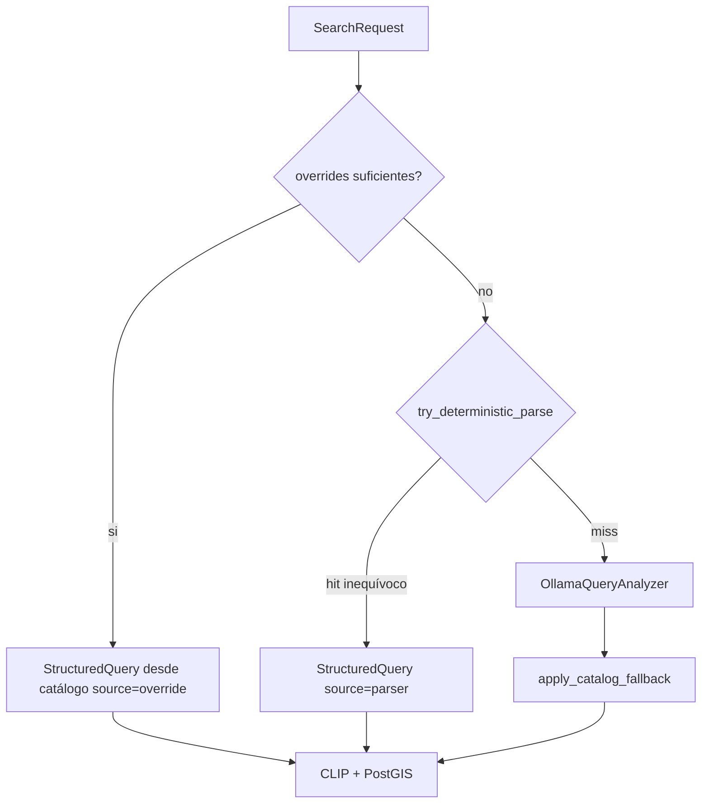

# Plan: Fast-path determinista (saltar LLM sin equívoco)

Plan **independiente** del LRU. Objetivo: reducir latencia en la **primera** consulta cuando no hace falta el modelo.

## Flujo objetivo



Orden en [`SearchDetectionsUseCase.execute`](api/application/use_cases/search_detections.py):

1. Overrides suficientes → **no llamar** `query_analyzer`.
2. Si no: `try_deterministic_parse(query)` → si OK, **no llamar** LLM.
3. Si no: flujo actual (Ollama + fallback).
4. Overrides parciales (p. ej. solo `spatial_distance_m`) siguen aplicándose **después** sobre el `StructuredQuery` ya resuelto (como hoy).

`llm_ms` = 0 cuando se salta el analizador.

## A) Overrides suficientes (sin LLM)

Condiciones en el use case (antes de `analyze`):

| Filtros presentes | Acción |
|-------------------|--------|
| `target` y **no** `reference` ni `spatial_relation` | `intent=search_class` vía `find_catalog_entry(target)`; attrs desde `extract_attributes_from_query(query)` |
| `target` + `reference` (y opcionalmente `spatial_relation=near`) | `intent=search_spatial`, relation `near`; mapear ambos con catálogo |
| Solo `reference` / solo `spatial_relation` sin `target` | **No** short-circuit → LLM o parser (falta target) |
| Solo `spatial_distance_m` | **No** short-circuit por sí solo |

Si `find_catalog_entry` falla en un override → `SearchValidationError` (igual que hoy en `_apply_request_overrides`).

Reutilizar la lógica de mapeo ya existente en `_apply_request_overrides`; extraer un helper `_build_from_overrides(request) -> StructuredQuery | None` que devuelva `None` si no hay short-circuit.

`source = "override"`.

## B) Fast-path determinista sobre texto NL

Nuevo módulo [`api/infrastructure/ai/deterministic_query_parser.py`](api/infrastructure/ai/deterministic_query_parser.py) (o funciones en catálogo + parser espacial). **Estricto:** solo match **exacto** de términos de catálogo tras limpiar tokens no-clase; **no** usar substring / token-overlap de `find_catalog_entry` (demasiado permisivo para saltar LLM).

### Regla de match inequívoco

Añadir `find_catalog_entry_exact(text) -> YoloClassEntry | None` en [`yolo_class_catalog.py`](api/infrastructure/ai/yolo_class_catalog.py):

- Normalizar texto (`_normalize_text`).
- Quitar stop words + sinónimos de color (`_strip_non_class_tokens`).
- Match solo con `_match_exact` (término de catálogo == texto limpio).
- Si tras quitar colores queda vacío o no hay exact match → `None`.

### Casos que resuelve el parser (sin LLM)

1. **Clase sola:** `"piscinas"`, `"cars"` → `search_class`.
2. **Clase + color(es):** `"coches rojos"`, `"red cars"` → `search_class` + `attributes` vía `extract_attributes_from_query`. Tras strip de colores, el resto debe ser exact match de una sola entrada.
3. **Espacial inequívoco:** `parse_spatial_relation(query)` OK **y** `find_catalog_entry_exact` en `target_fragment` **y** en `reference_fragment` → `search_spatial` / `near`, mismos campos que rellena `resolve_spatial_query`.

### Casos que **no** resuelve (caer a LLM)

- Resto de tokens tras strip que no sean exact match (`"quiero ver vehículos aparcados"`).
- Espacial parseado pero un fragmento sin exact match.
- Frases con distancia en lenguaje natural (`"a 30 metros"`) sin overrides — el LLM puede rellenar `distance_m`; el parser no inventa distancia.
- `intent` dudoso / multi-clase ambigua.
- Solo atributos sin clase (`"rojos"`).

API del helper:

```python
def try_deterministic_parse(query: str) -> StructuredQuery | None:
    ...
```

Idioma: `"es"` / `"en"` heurística simple (presencia de tokens ES vs EN del catálogo / colores); si no claro → `"unknown"`.
`reasoning`: cadena corta fija tipo `"deterministic catalog parse"` (no exponer al usuario como fallo).

`source = "parser"` en interpretación (ya contemplado en tests de GeoJSON con `interpretation_source="parser"`).

## Cableado

- [`search_detections.py`](api/application/use_cases/search_detections.py): orden override → deterministic → LLM; no tocar CLIP/PostGIS.
- **No** cambiar [`OllamaQueryAnalyzer`](api/infrastructure/ai/ollama_query_analyzer.py) salvo que se quiera documentar el orden; el fallback post-LLM se mantiene para el path LLM.
- Viewer: sin cambios obligatorios (chips de ejemplo ya se benefician del path B; params `target`/`reference` del path A cuando el cliente los envíe).
- Independiente del plan LRU: si ambos existen, orden natural = override → parser → LRU(Ollama). Este plan **no** implementa LRU.

## Tests

| Área | Casos |
|------|--------|
| `find_catalog_entry_exact` | hit `piscinas`; miss `vehículos aparcados`; color strip `coches rojos` → vehicle |
| `try_deterministic_parse` | clase; clase+color; espacial OK; espacial incompleto → None; basura → None |
| Use case | con `target` override: `query_analyzer.analyze` **no** await; `source=override`; `llm_ms==0` |
| Use case | `"piscinas"` sin overrides: analyzer no llamado; `source=parser` |
| Use case | query ambigua: analyzer sí llamado (mock) |
| No regresión | tests espaciales / hybrid existentes siguen verdes |

Archivos de test: ampliar [`test_spatial_query_parser.py`](api/tests/test_spatial_query_parser.py) / nuevo `test_deterministic_query_parser.py` + casos en [`test_search_use_case.py`](api/tests/test_search_use_case.py).

## Fuera de alcance

- LRU / caché de interpretaciones.
- Enviar `target`/`reference` desde chips del viewer (solo backend).
- Relación `inside`, distancias NL, atributos no-color.
- Cambiar el prompt de Ollama.
