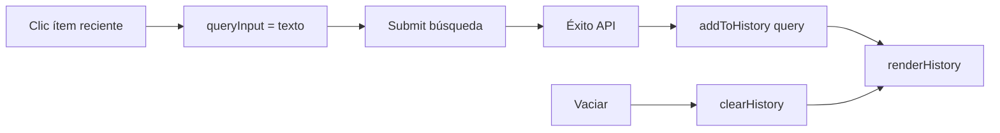

# Historial de búsquedas (últimas 5)

## Decisiones cerradas

- Guardar **solo el texto** de la consulta (no `top_k` / `per_layer_limit` / `min_confidence`).
- Al clic: **rellenar el input y lanzar la búsqueda** automáticamente.
- Borrado: **vaciar todo** de una vez (no × por ítem).
- Máximo **5** entradas; las más recientes primero.
- Deduplicar por texto exacto (trim): si se repite, sube al frente sin duplicar.

## UI

En el panel Búsqueda de [`api_webviewer/index.html`](api_webviewer/index.html), justo **después de los chips de ejemplos** y antes de “Opciones avanzadas”:

- Bloque `#search-history` con etiqueta “Recientes:”
- Lista `#search-history-list` (vacía al inicio → mensaje muted “Sin búsquedas recientes” o el bloque oculto)
- Botón pequeño “Vaciar” (`#btn-clear-history`), visible solo si hay ítems

Estilo en [`api_webviewer/css/styles.css`](api_webviewer/css/styles.css): reutilizar el patrón de `.quick-examples` / `.chip` para los ítems clicables; el botón Vaciar al estilo `btn-small btn-secondary` existente.

## Persistencia

En [`api_webviewer/js/api.js`](api_webviewer/js/api.js) (junto a `STORAGE_KEY` de la URL base), o helpers locales en `app.js` si se prefiere no mezclar:

- Clave: `api_webviewer_search_history`
- Valor: JSON array de strings, máx. 5
- API mínima: `loadHistory()`, `saveHistory(list)`, `addToHistory(query)`, `clearHistory()`

## Lógica en [`api_webviewer/js/app.js`](api_webviewer/js/app.js)

- Tras **búsqueda exitosa** (`renderResults` / justo después del `search` OK): `addToHistory(query.trim())` + `renderHistory()`.
- No guardar si la petición falla o el texto queda vacío.
- `renderHistory()`: pinta botones tipo chip; clic → `queryInput.value = texto` + `searchForm.requestSubmit()` (o disparar el mismo flujo del submit).
- Init: `renderHistory()` al arrancar.
- “Vaciar”: limpia localStorage y re-renderiza.

## Alcance

Solo frontend en `api_webviewer/`. Sin cambios de API ni tests backend.