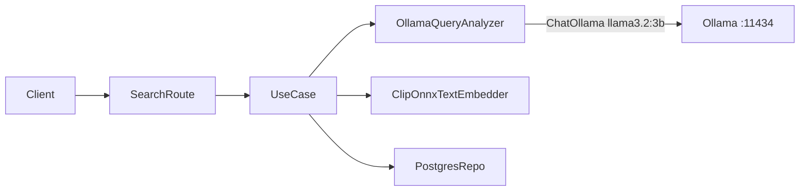

# Plan: Sustituir OpenAI por Llama local (Ollama)

## Contexto actual

El único uso de OpenAI en el API es el **análisis semántico de consultas** (ES/EN → `StructuredQuery` con `clase_yolo_candidates`). CLIP ya corre en local.


Archivos implicados:

| Archivo | Rol actual |
|---------|------------|
| [`api/infrastructure/ai/openai_query_analyzer.py`](api/infrastructure/ai/openai_query_analyzer.py) | `ChatOpenAI` + `with_structured_output(StructuredQuery)` |
| [`api/config.py`](api/config.py) | `openai_api_key`, `openai_model`, `openai_temperature` |
| [`api/api/dependencies.py`](api/api/dependencies.py) | Instancia `OpenAIQueryAnalyzer()` |
| [`api/api/routes/search.py`](api/api/routes/search.py) | Captura `OpenAIError` → 503 |
| [`api/requirements.txt`](api/requirements.txt) | `langchain-openai`, `openai` |
| [`api/.env`](api/.env) | `OPENAI_API_KEY`, `OPENAI_MODEL` |

La interfaz de dominio [`QueryAnalyzer`](api/domain/services/query_analyzer.py) y el caso de uso [`SearchDetectionsUseCase`](api/application/use_cases/search_detections.py) **no cambian** — solo la implementación de infraestructura.

## Arquitectura objetivo



## Cambios propuestos

### 1. Nueva implementación: `OllamaQueryAnalyzer`

Crear [`api/infrastructure/ai/ollama_query_analyzer.py`](api/infrastructure/ai/ollama_query_analyzer.py) reutilizando el `SYSTEM_PROMPT` y la lógica de post-procesado ya existentes en `openai_query_analyzer.py`:

```python
from langchain_ollama import ChatOllama

class OllamaQueryAnalyzer(QueryAnalyzer):
    def __init__(self) -> None:
        self._llm = ChatOllama(
            base_url=settings.ollama_base_url,
            model=settings.ollama_model,
            temperature=settings.ollama_temperature,
        ).with_structured_output(StructuredQuery)
```

- Mismo flujo `analyze()`: LLM → fallback con `resolve_clase_yolo_from_canonical()` si `clase_yolo_candidates` viene vacío.
- El prompt bilingüe y el catálogo estático en [`yolo_class_catalog.py`](api/infrastructure/ai/yolo_class_catalog.py) se mantienen sin cambios.
- **Modelo por defecto**: `llama3.2:3b` — ligero, suficiente para devolver un JSON con clase/idioma/intent.
- Eliminar [`openai_query_analyzer.py`](api/infrastructure/ai/openai_query_analyzer.py) tras la migración (o dejarlo solo si se quiere soporte dual; no recomendado para mantener simplicidad).

### 2. Configuración en [`config.py`](api/config.py)

Reemplazar bloque OpenAI por Ollama:

```python
# Ollama (LLM local)
ollama_base_url: str = "http://localhost:11434"
ollama_model: str = "llama3.2:3b"
ollama_temperature: float = 0.0
```

Eliminar `openai_api_key`, `openai_model`, `openai_temperature`.

### 3. Inyección de dependencias

En [`api/api/dependencies.py`](api/api/dependencies.py):

```python
from infrastructure.ai.ollama_query_analyzer import OllamaQueryAnalyzer
# ...
query_analyzer=OllamaQueryAnalyzer(),
```

### 4. Manejo de errores en la ruta `/search`

En [`api/api/routes/search.py`](api/api/routes/search.py), sustituir `OpenAIError` por una excepción de dominio/infraestructura genérica, p. ej. `QueryAnalyzerError` (nueva en `domain/services/query_analyzer.py` o `infrastructure/ai/exceptions.py`), que envuelva fallos de conexión a Ollama, timeout o JSON malformado.

Esto desacopla la capa API del proveedor concreto.

### 5. Dependencias Python

En [`api/requirements.txt`](api/requirements.txt):

- **Añadir**: `langchain-ollama>=0.2.0`
- **Eliminar**: `langchain-openai`, `openai`
- **Mantener**: `langchain-core` (ya requerido por structured output)

### 6. Variables de entorno

Actualizar [`api/.env`](api/.env) (referencia local, no commitear):

```env
# --- Ollama (LLM local) ---
OLLAMA_BASE_URL=http://localhost:11434
OLLAMA_MODEL=llama3.2:3b
OLLAMA_TEMPERATURE=0.0
```

Eliminar `OPENAI_API_KEY` y `OPENAI_MODEL`.

### 7. (Opcional) Health check ampliado

En [`api/api/routes/health.py`](api/api/routes/health.py), añadir campo `llm_model` y opcionalmente `llm_status` haciendo un `GET {ollama_base_url}/api/tags` con `httpx` (ya está en requirements). Útil para detectar si Ollama no está levantado o el modelo no está descargado.

## Requisitos previos en el entorno (fuera del código)

Antes de probar `/search`:

```bash
# Instalar Ollama (https://ollama.com)
ollama pull llama3.2:3b
ollama serve   # suele arrancar automáticamente en Windows
```

Verificar:

```bash
curl http://localhost:11434/api/tags
```

## Pruebas

1. **Unitarias existentes** ([`api/tests/test_api_routes.py`](api/tests/test_api_routes.py)): siguen pasando porque mockean `query_analyzer`.
2. **Prueba manual** contra BBDD cargada:
   - `POST /search {"query": "piscinas"}` → `detected_language: "es"`, clases `swimming_pool`
   - `POST /search {"query": "cars"}` → clases de vehículo
   - Apagar Ollama → debe devolver `503` con mensaje claro
3. **(Opcional)** Test de integración con Ollama real marcado `@pytest.mark.integration` para no bloquear CI sin Ollama.

## Riesgos y mitigaciones

| Riesgo | Mitigación |
|--------|------------|
| Modelo pequeño devuelve JSON inválido | `with_structured_output` + fallback `resolve_clase_yolo_from_canonical()` ya existente |
| Ollama no arrancado | Excepción `QueryAnalyzerError` → 503; health opcional |
| Latencia en CPU | Aceptable para tarea acotada; `llama3.2:3b` es el más ligero de la familia Llama 3 |
| Primera inferencia lenta (cold start) | Precargar modelo en `lifespan` con una llamada de warm-up opcional |

## Fuera de alcance

- Sustituir CLIP (ya es local; el nombre `openai/clip-vit-base-patch32` es solo el identificador HuggingFace del modelo, no implica API de OpenAI).
- Soporte dual OpenAI/Ollama con switch de proveedor (se puede añadir después si se necesita).
- Despliegue de Ollama en Docker (documentable pero no bloqueante para el cambio de código).
