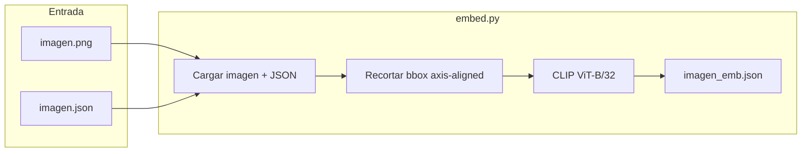

# Plan: Script de embeddings CLIP (`embed.py`)

## Objetivo

Añadir un tercer script al pipeline que convierta cada detección YOLO en un vector semántico de **512 dimensiones** (CLIP ViT-B/32), describiendo el contenido visual del recorte (colores, tipo de objeto, contexto).



**Pipeline completo:** `detect.py --batch` → `embed.py --batch` → (futuro: búsqueda por similitud)

---

## Convenciones (alineadas con el proyecto)

| Aspecto | Convención |
|---------|------------|
| Script | Nuevo [`embed.py`](D:\TFM\yolo_example\embed.py) |
| Entrada detecciones | JSON companion existente ([`24711.json`](D:\TFM\yolo_example\pruebas\tiles16\16\32101\24711.json)) |
| Imagen fuente | Campo `source_image` del JSON (o imagen pasada por CLI) |
| Salida | `{stem}_emb.json` junto a la imagen/JSON (ej. `24711_emb.json`) |
| Estilo CLI | Mismo patrón que [`detect.py`](D:\TFM\yolo_example\detect.py): `argparse`, español, `tqdm`, `--skip-existing`, códigos de salida 0/1/2 |
| Utilidades compartidas | Extender [`utils.py`](D:\TFM\yolo_example\utils.py) |

---

## Interfaz CLI propuesta

```bash
# Una imagen (requiere companion .json)
python embed.py pruebas/tiles16/16/32101/24711.png

# Un JSON de detecciones directamente
python embed.py pruebas/tiles16/16/32101/24711.json

# Batch recursivo (todas las imágenes con JSON de detecciones)
python embed.py --batch pruebas/tiles16/ --skip-existing

# Filtros opcionales
python embed.py --batch pruebas/tiles16/ --min-conf 0.5 --classes car,Building
python embed.py --batch pruebas/tiles16/ --batch-size 32 --padding 4
```

**Argumentos:**

| Argumento | Descripción |
|-----------|-------------|
| `input` (posicional) | Ruta a imagen **o** JSON de detecciones |
| `--batch CARPETA` | Procesa recursivamente (mutuamente excluyente con posicional) |
| `--skip-existing` | Salta si `{stem}_emb.json` ya existe |
| `--min-conf` | Filtra detecciones por confianza (default: 0, sin filtro) |
| `--classes` | Lista separada por comas (`car,Building`) |
| `--source-model` | Filtra por `source_model` del JSON |
| `--padding` | Píxeles extra alrededor del bbox antes del recorte (default: 0) |
| `--batch-size` | Tamaño de lote para inferencia CLIP (default: 16) |
| `--model` | Modelo CLIP HuggingFace (default: `openai/clip-vit-base-patch32`) |

**Modo batch:** reutilizar `discover_images()` de [`utils.py`](D:\TFM\yolo_example\utils.py) y procesar solo imágenes cuyo companion JSON exista (`companion_json_path`). Ignorar imágenes sin detecciones previas.

---

## Lógica de recorte (decisión confirmada)

Para **todas** las detecciones (axis y OBB), usar el **bbox axis-aligned** (`bbox.x1/y1/x2/y2`) ya presente en el JSON. No implementar recorte rotado.

Nueva función en `utils.py`:

```python
def crop_detection_axis(
    image_bgr: np.ndarray,
    detection: dict,
    padding: int = 0,
) -> np.ndarray | None:
    # Clip bbox a límites de imagen; retorna None si recorte vacío
```

Flujo por tile:
1. Leer JSON de detecciones
2. Cargar `source_image` con `cv2.imread` (mismo patrón que [`visualize.py`](D:\TFM\yolo_example\visualize.py) líneas 86-97)
3. Filtrar detecciones según flags CLI
4. Recortar cada bbox → lista de crops BGR
5. Convertir BGR→RGB, preprocesar con `CLIPProcessor`
6. Inferir en lotes de `--batch-size` → vectores L2-normalizados de dim 512

---

## Modelo CLIP (decisión confirmada)

- **Modelo por defecto:** `openai/clip-vit-base-patch32` → **512 dimensiones**
- **Librería:** `transformers` (`CLIPModel` + `CLIPProcessor`)
- **Dispositivo:** reutilizar patrón `resolve_device()` de `detect.py` (`cuda:0` si disponible, si no `cpu`)
- **Normalización:** aplicar `model.get_image_features()` y normalizar L2 (estándar para similitud coseno)

Primera ejecución descargará pesos vía HuggingFace (el proyecto ya usa `huggingface_hub`).

---

## Esquema de salida: `{stem}_emb.json`

Ejemplo para `24711.png` → `24711_emb.json`:

```json
{
  "source_image": "D:\\TFM\\yolo_example\\pruebas\\tiles16\\16\\32101\\24711.png",
  "source_detection_json": "D:\\TFM\\yolo_example\\pruebas\\tiles16\\16\\32101\\24711.json",
  "embedding_model": "openai/clip-vit-base-patch32",
  "embedding_dim": 512,
  "padding_px": 0,
  "filters": {
    "min_confidence": 0.0,
    "classes": null,
    "source_model": null
  },
  "embedding_count": 142,
  "embeddings": [
    {
      "detection_index": 0,
      "class_name": "car",
      "class_id": 3,
      "confidence": 0.8012,
      "source_model": "visdrone-yolov11s",
      "bbox_type": "axis",
      "bbox": { "x1": 1939.75, "y1": 1934.03, "x2": 1962.02, "y2": 1949.95 },
      "embedding": [0.0123, -0.0345, "... 512 floats ..."]
    }
  ]
}
```

**Notas de diseño:**
- `detection_index` = índice en el array `detections` del JSON fuente (estable para correlacionar)
- Se copian metadatos mínimos de cada detección (no todo el JSON) para trazabilidad sin duplicar `bbox3857`
- Un archivo por imagen (no un JSON por detección), como pediste

Nueva utilidad en `utils.py`:

```python
def companion_embedding_json_path(base_path: Path) -> Path:
    # 24711.png o 24711.json → 24711_emb.json
    return base_path.with_name(f"{base_path.stem}_emb.json")
```

---

## Resumen batch

Al finalizar `--batch`, escribir `embedding_summary.json` en la raíz de la carpeta (análogo a `detection_summary.json` de detect):

```json
{
  "source_folder": "...",
  "embedding_model": "openai/clip-vit-base-patch32",
  "embedding_dim": 512,
  "run": { "processed": 18, "skipped": 0, "failed": 0, "total_images": 18 },
  "total_embeddings": 7626,
  "embeddings_by_class": { "car": 3200, "Building": 150, "...": "..." },
  "failures": []
}
```

---

## Cambios en archivos

### 1. [`utils.py`](D:\TFM\yolo_example\utils.py) — helpers reutilizables

- `companion_embedding_json_path(base_path)` — ruta de salida `{stem}_emb.json`
- `crop_detection_axis(image_bgr, detection, padding)` — recorte bbox
- `load_detection_json(json_path)` — validar estructura mínima (`source_image`, `detections`, `bbox`)
- `resolve_source_image_path(json_path, payload)` — resolver ruta de imagen (absoluta del JSON o relativa al JSON)

### 2. [`embed.py`](D:\TFM\yolo_example\embed.py) — script principal (~350-450 líneas)

Estructura espejo de `detect.py`:

| Función | Responsabilidad |
|---------|-----------------|
| `parse_args()` | CLI con validación mutua batch/posicional |
| `load_clip_model(model_name, device)` | Cargar modelo una vez, reutilizar en batch |
| `encode_crops(model, processor, crops, batch_size)` | Inferencia por lotes |
| `filter_detections(detections, args)` | Filtros conf/clase/modelo |
| `run_embedding(json_path, ...)` | Procesar un tile |
| `run_single(input_path, ...)` | Modo imagen o JSON |
| `run_batch(folder, ...)` | Loop con `tqdm`, `--skip-existing` |
| `write_embedding_summary(...)` | Resumen agregado |
| `main()` | Orquestación |

### 3. [`requirements.txt`](D:\TFM\yolo_example\requirements.txt)

Añadir:

```
transformers>=4.40.0
Pillow>=10.0.0
```

(`torch` y `numpy` ya vienen del entorno Conda; `transformers` trae la dependencia de CLIP)

---

## Consideraciones de rendimiento

Con tiles de ~140-400+ detecciones cada uno (ej. [`24711.json`](D:\TFM\yolo_example\pruebas\tiles16\16\32101\24711.json) tiene miles de entradas), el cuello de botella será CLIP:

- **Precargar modelo una vez** al inicio del batch (igual que YOLO en detect)
- **Batching GPU/CPU** con `--batch-size` (default 16)
- **Cargar imagen una vez por tile**, no por detección
- **CPU en AMD** (según plan previo del proyecto): viable con batching; estimar ~2-5 s/tile en CPU vs <0.5 s en CUDA

Tamaño de salida: 512 floats × ~4 bytes × N detecciones. Un tile con 200 detecciones ≈ 400 KB de embeddings en JSON (aceptable; JSON indentado será más grande).

---

## Validación manual propuesta

```bash
# 1. Un tile concreto
python embed.py pruebas/tiles16/16/32101/24711.json

# 2. Verificar salida
#    - Existe 24711_emb.json
#    - embedding_dim == 512
#    - embedding_count == len(detections) filtradas
#    - cada vector tiene norma ~1.0

# 3. Batch con skip
python embed.py --batch pruebas/tiles16/ --skip-existing

# 4. Re-ejecutar batch → todo skipped
```

---

## Fuera de alcance (fase 1)

- Búsqueda por similitud / índice vectorial (FAISS, etc.)
- Integración en `visualize.py`
- Recorte OBB rotado (`--obb-rotated`)
- Modelo ViT-L/14 (768 dims) — se puede añadir después cambiando `--model`
- Embeddings de texto (solo imagen/crop en esta fase)
