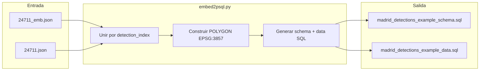

# Plan: Script `embed2psql.py` (PostGIS + pgvector)

## Objetivo

Cuarto paso del pipeline: convertir detecciones + embeddings CLIP en SQL listo para cargar en PostgreSQL con **PostGIS** (geometría) y **pgvector** (búsqueda semántica).



**Pipeline completo:** `detect.py --batch` → `embed.py --batch` → **`embed2psql.py --batch`** → `psql -f schema.sql -f data.sql`

---

## Decisiones confirmadas

| Aspecto | Decisión |
|---------|----------|
| `tile_id` | Solo coordenadas gdal2tiles: `16/32101/24711` (z/x/y, sin extensión) |
| Salida | Dos ficheros: `{capa}_schema.sql` + `{capa}_data.sql` |
| `metadata` | `'{}'::jsonb` (vacío por ahora; sin color/fecha/área) |
| `modelo_deteccion` | Campo `source_model` del JSON (modelo YOLO que generó la detección) |
| SRID geometría | **EPSG:3857** (coherente con `bbox3857` / `obb3857` ya en los JSON) |
| Índice vectorial | **HNSW** con `vector_cosine_ops` (embeddings CLIP L2-normalizados en [`embed.py`](D:\TFM\yolo_example\embed.py)) |

---

## Mapeo de columnas

| Columna SQL | Origen |
|-------------|--------|
| `id` | SERIAL — no se incluye en INSERT |
| `tile_id` | `parse_gdal2tiles_path(source_image)` → `"{z}/{x}/{y}"` |
| `clase_yolo` | `embedding.class_name` |
| `modelo_deteccion` | `embedding.source_model` (ej: `visdrone-yolov11s`, `yolo11m-obb.pt`) |
| `embedding` | `embedding.embedding` → literal `'[f1,f2,...]'::vector(512)` |
| `geom` | `bbox3857` (axis) o `obb3857` (obb) → `ST_SetSRID(ST_GeomFromText('POLYGON(...)'), 3857)` |
| `confianza` | `embedding.confidence` |
| `metadata` | `'{}'::jsonb` |

**Join obligatorio:** cada entrada de `*_emb.json` referencia `detection_index` en el array `detections` del JSON companion ([`24711_emb.json`](D:\TFM\yolo_example\pruebas\tiles16\16\32101\24711_emb.json) + [`24711.json`](D:\TFM\yolo_example\pruebas\tiles16\16\32101\24711.json)). Los embeddings no traen `bbox3857`; la geometría sale siempre del JSON de detecciones.

**Geometría:**
- `bbox_type == "axis"`: polígono rectangular desde `bbox3857` con `ST_MakeEnvelope(LEAST(x1,x2), LEAST(y1,y2), GREATEST(x1,x2), GREATEST(y1,y2))`
- `bbox_type == "obb"`: polígono de 4 vértices desde `obb3857.points`, cerrando el anillo (primer punto repetido al final)

---

## Esquema SQL generado (`{capa}_schema.sql`)

```sql
CREATE EXTENSION IF NOT EXISTS postgis;
CREATE EXTENSION IF NOT EXISTS vector;

CREATE TABLE IF NOT EXISTS madrid_detections_example (
    id               SERIAL PRIMARY KEY,
    tile_id          VARCHAR NOT NULL,
    clase_yolo       VARCHAR NOT NULL,
    modelo_deteccion VARCHAR NOT NULL,
    embedding        vector(512) NOT NULL,
    geom             GEOMETRY(Polygon, 3857) NOT NULL,
    confianza        FLOAT NOT NULL,
    metadata         JSONB NOT NULL DEFAULT '{}'::jsonb
);

CREATE INDEX IF NOT EXISTS idx_madrid_detections_example_geom
    ON madrid_detections_example USING GIST (geom);

CREATE INDEX IF NOT EXISTS idx_madrid_detections_example_modelo
    ON madrid_detections_example (modelo_deteccion);

CREATE INDEX IF NOT EXISTS idx_madrid_detections_example_embedding
    ON madrid_detections_example USING hnsw (embedding vector_cosine_ops);
```

Los nombres de índice incluirán el nombre de capa para evitar colisiones si se cargan varias capas en la misma BD.

---

## Datos SQL generados (`{capa}_data.sql`)

INSERTs en lotes (default **50 filas** por sentencia) para legibilidad y rendimiento de carga:

```sql
INSERT INTO madrid_detections_example
    (tile_id, clase_yolo, modelo_deteccion, embedding, geom, confianza, metadata)
VALUES
    ('16/32101/24711', 'car', 'visdrone-yolov11s', '[0.004,...]'::vector(512),
     ST_SetSRID(ST_MakeEnvelope(-407288.808, 4926242.875, -407282.159, 4926247.628), 3857),
     0.8012, '{}'::jsonb),
    (...);
```

Escapado SQL: comillas simples en `class_name` y `modelo_deteccion`, formato compacto del vector (sin espacios extra innecesarios).

---

## Interfaz CLI

Mismo estilo que [`embed.py`](D:\TFM\yolo_example\embed.py) y [`detect.py`](D:\TFM\yolo_example\detect.py):

```bash
# Un tile
python embed2psql.py --layer madrid_detections_example \
    pruebas/tiles16/16/32101/24711_emb.json

# Batch recursivo
python embed2psql.py --layer madrid_detections_example \
    --batch pruebas/tiles16/

# Directorio de salida personalizado
python embed2psql.py --layer madrid_detections_example \
    --batch pruebas/tiles16/ --output-dir sql/

# Filtros opcionales (mismos criterios que embed)
python embed2psql.py --layer madrid_detections_example \
    --batch pruebas/tiles16/ --min-conf 0.5 --classes car,Building
```

| Argumento | Descripción |
|-----------|-------------|
| `--layer NOMBRE` | **Obligatorio.** Nombre de tabla/capa (validar: `[a-zA-Z_][a-zA-Z0-9_]*`) |
| `input` (posicional) | Ruta a `*_emb.json` |
| `--batch CARPETA` | Procesa recursivamente todos los `*_emb.json` |
| `--output-dir DIR` | Carpeta destino (default: raíz del proyecto, junto a los scripts) |
| `--insert-batch-size N` | Filas por INSERT (default: 50) |
| `--min-conf`, `--classes`, `--source-model` | Filtros reutilizando lógica de embed |
| `--skip-missing-geom` | Saltar detecciones sin `bbox3857`/`obb3857` con aviso (default) |
| `--strict` | Fallar si falta geometría en lugar de saltar |

**Salida por defecto** (con `--layer madrid_detections_example`):
- `madrid_detections_example_schema.sql`
- `madrid_detections_example_data.sql`
- `embed2psql_summary.json` en la carpeta batch (análogo a `embedding_summary.json`)

---

## Cambios en archivos

### 1. [`utils.py`](D:\TFM\yolo_example\utils.py) — helpers SQL/geometría

Nuevas funciones reutilizables:

| Función | Responsabilidad |
|---------|-----------------|
| `build_tile_id(image_path) -> str` | `parse_gdal2tiles_path` → `f"{z}/{x}/{y}"`; error si no coincide |
| `load_embedding_json(path) -> dict` | Validar estructura mínima (`embeddings`, `embedding_dim`, `source_detection_json`) |
| `discover_embedding_jsons(folder) -> list[Path]` | `rglob("*_emb.json")` ordenado |
| `detection_geometry_3857(detection) -> str` | WKT `POLYGON(...)` desde `bbox3857` u `obb3857` |
| `format_pgvector_literal(values) -> str` | `'[...]'::vector(512)` |
| `sql_escape(text) -> str` | Escapar comillas simples |

La lógica de conversión EPSG:3857 ya existe en [`utils.py`](D:\TFM\yolo_example\utils.py) (`pixel_to_epsg3857`, `enrich_detections_with_epsg3857`); no se recalcula — se lee `bbox3857`/`obb3857` del JSON de detecciones.

### 2. [`embed2psql.py`](D:\TFM\yolo_example\embed2psql.py) — script principal (~300-400 líneas)

Estructura espejo de `embed.py`:

| Función | Responsabilidad |
|---------|-----------------|
| `parse_args()` | CLI; `--layer` obligatorio; validación batch/posicional mutua |
| `validate_layer_name(name)` | Regex identificador SQL seguro |
| `filter_embeddings(entries, args)` | Reutilizar criterios min-conf/clases/source-model |
| `build_row(emb_entry, detection, tile_id)` | Tupla de valores SQL |
| `write_schema_sql(path, layer)` | DDL + extensiones + índices |
| `write_data_sql(path, layer, rows, batch_size)` | INSERTs agrupados |
| `process_embedding_file(emb_path, args)` | Cargar emb + det JSON, emitir filas |
| `run_batch(folder, args)` | Loop con `tqdm`, resumen |
| `write_embed2psql_summary(...)` | Estadísticas de filas/tiles/errores |
| `main()` | Orquestación |

### 3. Sin cambios en `requirements.txt`

El script solo genera SQL; no necesita `psycopg2` ni dependencias nuevas.

---

## Flujo por fichero `*_emb.json`

1. Cargar `24711_emb.json`
2. Resolver JSON de detecciones vía `source_detection_json` (o `companion_json_path` del stem)
3. Extraer `tile_id` desde `source_image` con `build_tile_id()` → `16/32101/24711`
4. Por cada embedding (filtrado):
   - Obtener `detections[detection_index]`
   - Verificar coherencia (`class_name`, `confidence`, `source_model` coinciden entre embedding y detección)
   - Construir WKT desde `bbox3857` u `obb3857`
   - Acumular fila SQL
5. Escribir/append al buffer de data SQL

---

## Validación manual propuesta

```bash
# 1. Un tile de prueba
python embed2psql.py --layer madrid_detections_example \
    pruebas/tiles16/16/32101/24711_emb.json

# 2. Verificar salida
#    - madrid_detections_example_schema.sql contiene CREATE TABLE + índices
#    - madrid_detections_example_data.sql tiene ~118 INSERTs (118 detecciones en 24711)
#    - tile_id = '16/32101/24711' en todas las filas de ese tile

# 3. Batch completo
python embed2psql.py --layer madrid_detections_example --batch pruebas/tiles16/

# 4. Cargar en PostgreSQL (manual)
psql -d mi_db -f madrid_detections_example_schema.sql
psql -d mi_db -f madrid_detections_example_data.sql

# 5. Comprobar
# SELECT COUNT(*), COUNT(DISTINCT tile_id) FROM madrid_detections_example;
# SELECT modelo_deteccion, COUNT(*) FROM madrid_detections_example GROUP BY 1;
# SELECT ST_AsText(geom) FROM madrid_detections_example LIMIT 1;
```

---

## Consideraciones

- **Tamaño del SQL:** ~7k+ detecciones × 512 floats → `*_data.sql` puede pesar decenas de MB. Aceptable para fase 1; optimización futura: `\copy` CSV + `ST_GeomFromText` en staging.
- **OBB vs axis:** campos deportivos (`yolo11m-obb.pt`) usan polígono rotado desde `obb3857`; el resto usa envelope rectangular.
- **Re-ejecución:** el schema usa `IF NOT EXISTS`; los INSERTs no son idempotentes — documentar que conviene `TRUNCATE` o `DROP TABLE` antes de recargar.
- **Seguridad:** validación estricta del nombre de capa para evitar inyección SQL en identificadores.

---

## Fuera de alcance (fase 1)

- Conexión directa a PostgreSQL / carga automática
- Conversión a EPSG:4326
- Población de `metadata` (color, fecha, área m²)
- Búsqueda semántica desde Python (consultas de similitud)
- Formato COPY/CSV alternativo
