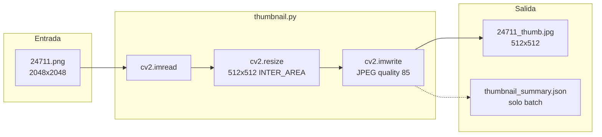

# Plan: script de thumbnails 512×512

## Contexto

El proyecto ya tiene un pipeline de tres scripts ([`detect.py`](D:\TFM\yolo_example\detect.py), [`embed.py`](D:\TFM\yolo_example\embed.py), [`visualize.py`](D:\TFM\yolo_example\visualize.py)) con convenciones claras:

- CLI en español con `argparse`, modos **imagen única** y **`--batch`**
- Descubrimiento recursivo vía [`discover_images()`](D:\TFM\yolo_example\utils.py)
- Ficheros companion junto a la fuente (`24711.json`, `24711_emb.json`)
- Resumen batch en la raíz (`detection_summary.json`, `embedding_summary.json`)
- Dependencias de imagen ya disponibles: **OpenCV** y **Pillow** en [`requirements.txt`](D:\TFM\yolo_example\requirements.txt)

Las imágenes típicas son tiles gdal2tiles **2048×2048** en rutas como `pruebas/tiles16/16/32101/24711.png`. Un thumbnail 512×512 reduce ~16× los píxeles (ideal para enviar ejemplos por red).



## Archivos a crear/modificar

| Archivo | Acción |
|---------|--------|
| [`thumbnail.py`](D:\TFM\yolo_example\thumbnail.py) | **Nuevo** — script principal |
| [`utils.py`](D:\TFM\yolo_example\utils.py) | **Añadir** `companion_thumbnail_path()` |

No se modifica `requirements.txt` (OpenCV ya cubre lectura, resize y escritura JPEG).

## Diseño del script `thumbnail.py`

### Responsabilidad

Redimensionar cada imagen soportada a **exactamente 512×512** y guardar un JPEG optimizado para transmisión rápida.

### Convención de salida (elegida por el usuario)

```
24711.png  →  24711_thumb.jpg   (misma carpeta)
```

Función helper en `utils.py`:

```python
def companion_thumbnail_path(image_path: Path) -> Path:
    return image_path.with_name(f"{image_path.stem}_thumb.jpg")
```

### Algoritmo de resize

- **`cv2.imread`** para cargar la imagen
- **`cv2.resize(..., (512, 512), interpolation=cv2.INTER_AREA)`** — interpolación adecuada para downscale (2048→512)
- Para imágenes no cuadradas: resize directo a 512×512 (puede deformar ligeramente). En la práctica del proyecto (tiles cuadrados) no aplica distorsión
- Formato de salida: **JPEG** fijo (`.jpg`), con `--quality` configurable (por defecto **85**)

### Exclusiones en batch

Durante el procesamiento, omitir ficheros que ya son thumbnails:

- Sufijo `_thumb` en el stem (p. ej. `24711_thumb.jpg`)
- Evita regenerar thumbnails de thumbnails si se ejecuta `--batch` sobre una carpeta que ya los contiene

### CLI (misma estructura que `detect.py` / `embed.py`)

```
python thumbnail.py IMAGEN
python thumbnail.py --batch CARPETA
python thumbnail.py --batch CARPETA --skip-existing
python thumbnail.py IMAGEN --quality 80 --size 512
```

| Argumento | Descripción |
|-----------|-------------|
| `image` (posicional) | Ruta a una imagen |
| `--batch CARPETA` | Procesa recursivamente con `discover_images()` |
| `--skip-existing` | Salta si `{stem}_thumb.jpg` ya existe |
| `--size N` | Tamaño cuadrado (por defecto: **512**) |
| `--quality N` | Calidad JPEG 1–100 (por defecto: **85**) |

Validaciones:

- Sin argumentos → help + exit 2
- `--batch` y posicional juntos → `parser.error`
- Imagen ilegible o vacía → error por fichero, batch continúa

### Funciones internas (patrón existente)

Reutilizar el esqueleto de [`embed.py`](D:\TFM\yolo_example\embed.py):

- `parse_args()` — argparse + EPILOG en español con ejemplos
- `report_error()` — stderr con sugerencias
- `run_single(image_path, ...) -> bool` — procesa un fichero
- `run_batch(folder, ...) -> dict` — tqdm + contadores processed/skipped/failed
- `write_batch_summary(folder, stats)` — escribe `thumbnail_summary.json`
- `main() -> int` — exit codes 0/1/2

### Contenido de `thumbnail_summary.json`

```json
{
  "thumbnail_size": 512,
  "jpeg_quality": 85,
  "processed": 18,
  "skipped": 0,
  "failed": 0,
  "total_bytes_saved_estimate": "...",
  "files": [
    {
      "source": "16/32101/24711.png",
      "thumbnail": "16/32101/24711_thumb.jpg",
      "source_size_px": [2048, 2048],
      "source_bytes": 1234567,
      "thumbnail_bytes": 45678
    }
  ]
}
```

Incluir bytes origen/thumbnail por fichero para verificar la ganancia de compresión (útil para “transmisión rápida”).

### EPILOG (ejemplos documentados)

```
python thumbnail.py pruebas/tiles16/16/32101/24711.png
python thumbnail.py --batch pruebas/tiles16/
python thumbnail.py --batch pruebas/tiles16/ --skip-existing
python thumbnail.py --batch pruebas/tiles16/ --quality 75
```

## Integración con el pipeline existente

El script es **independiente** (no requiere JSON de detecciones). Encaja como paso previo opcional para:

- Enviar ejemplos de tiles por API/chat sin subir PNGs de 2048×2048
- Previsualizar ortofotos en interfaces web ligeras

Orden sugerido de uso:

```
thumbnail.py  →  detect.py  →  embed.py  →  visualize.py
```

Los thumbnails no alteran rutas gdal2tiles (`z/x/y.png`); son companions adicionales.

## Verificación manual

Tras implementar, probar con:

1. **Imagen única** (cuando existan PNGs en `pruebas/tiles16/`):
   ```bash
   python thumbnail.py pruebas/tiles16/16/32101/24711.png
   ```
   Comprobar: existe `24711_thumb.jpg`, dimensiones 512×512, tamaño en disco << original.

2. **Batch con skip**:
   ```bash
   python thumbnail.py --batch pruebas/tiles16/ --skip-existing
   ```
   Segunda ejecución debe reportar todos como skipped.

3. **Resumen**: validar `thumbnail_summary.json` en la raíz de la carpeta batch.
