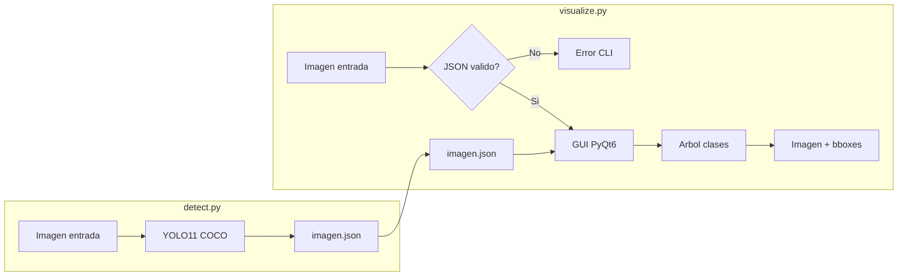

# Plan: Scripts YOLO detección + visualización urbana

## Contexto confirmado

- Proyecto vacío en [`D:\TFM\yolo_example`](D:\TFM\yolo_example).
- **Entorno Conda** con Python 3.11, **PyTorch** y **Ultralytics/YOLO** ya instalados (el usuario gestiona ese entorno; los scripts se ejecutan dentro de él).
- **Modelo:** YOLO preentrenado COCO (objetos generales de calle).
- **Script 1:** una imagen por ejecución; el JSON se guarda en la misma carpeta y con el mismo nombre base que la imagen (sobrescribe si existe).
- **Script 2:** GUI de escritorio con árbol para activar/desactivar clases; se lanza por CLI.
- **GPU:** AMD Radeon (no NVIDIA/CUDA).

## Modelo YOLO recomendado

**Recomendación principal: `yolo11s.pt`** (vía [Ultralytics](https://docs.ultralytics.com/)).

| Modelo | Uso recomendado |
|--------|-----------------|
| `yolo11n.pt` | Más rápido, menos preciso (prototipos / CPU) |
| **`yolo11s.pt`** | **Equilibrio calidad/velocidad (recomendado para empezar)** |
| `yolo11m.pt` | Más preciso, más lento y más RAM |

Ultralytics descargará el peso automáticamente en el primer uso.

### Clases que detectará (dataset COCO, 80 clases)

El modelo devuelve **todas las clases COCO**. En escenas urbanas las más habituales son:

- **Personas y movilidad:** `person`, `bicycle`, `car`, `motorcycle`, `bus`, `truck`
- **Señalización:** `traffic light`, `stop sign`
- **Entorno urbano:** `bench`, `fire hydrant`, `parking meter`, `backpack`, `handbag`, `suitcase`, `umbrella`
- **Otros COCO posibles:** `bird`, `dog`, `cat`, `chair`, `bottle`, `cup`, etc. (menos frecuentes en calle, pero el modelo puede detectarlos)

No filtraremos clases en la detección; el JSON guardará todo lo que supere el umbral de confianza. El visualizador permitirá ocultar clases por árbol.

### Nota importante: GPU AMD en Windows

PyTorch/Ultralytics en Windows está optimizado para **CUDA (NVIDIA)**. Con **AMD Radeon**, lo más fiable para este TFM es:

1. **Por defecto:** inferencia en **CPU** (funciona siempre).
2. **Opcional futuro:** explorar `torch-directml` u ONNX+DirectML si necesitas aceleración AMD (más complejo y menos estable que CUDA).

El script 1 usará `device="auto"` de Ultralytics con fallback documentado a CPU si no hay backend GPU compatible.

---

## Arquitectura propuesta



---

## Archivos a crear

### 1. [`requirements.txt`](requirements.txt)

Documenta solo las dependencias **que faltan** en el entorno Conda del usuario. **No reinstalar** PyTorch ni Ultralytics si ya están operativos en Conda.

```text
opencv-python>=4.8.0
PyQt6>=6.6.0
```

**Ya presentes en Conda (no incluir en requirements.txt):**
- `torch` (PyTorch)
- `ultralytics` (YOLO)

**Instalación dentro del entorno Conda activo** (pip es válido y habitual en Conda para paquetes no disponibles en conda-forge):

```bash
conda activate <nombre-entorno-yolo>
pip install -r requirements.txt
```

**Verificación previa recomendada:**

```bash
conda activate <nombre-entorno-yolo>
python --version          # 3.11.x
python -c "import torch; print(torch.__version__)"
python -c "from ultralytics import YOLO; print('OK')"
```

Si `ultralytics` o `opencv` fallan al importar, instalar solo el paquete concreto con `pip` o `conda` según prefiera el usuario, sin recrear el entorno.

### 2. [`detect.py`](detect.py) — Script 1

**CLI propuesta:**

```bash
python detect.py ruta/a/foto.jpg
python detect.py ruta/a/foto.jpg --model yolo11s.pt --conf 0.25
```

**Comportamiento:**
- Valida que la imagen existe y es legible.
- Ejecuta inferencia YOLO11 COCO.
- Genera `ruta/a/foto.json` (mismo directorio y nombre base; sobrescribe).
- Imprime resumen en consola (nº detecciones por clase).

**Esquema JSON** (una entrada por detección):

```json
{
  "source_image": "ruta/a/foto.jpg",
  "model": "yolo11s.pt",
  "confidence_threshold": 0.25,
  "image_size": {"width": 1920, "height": 1080},
  "detections": [
    {
      "class_id": 2,
      "class_name": "car",
      "confidence": 0.91,
      "bbox": {"x1": 120.5, "y1": 80.2, "x2": 450.0, "y2": 320.7}
    }
  ]
}
```

- `bbox`: coordenadas absolutas en píxeles `[x1, y1, x2, y2]` (esquina superior izquierda → inferior derecha).
- Parámetros configurables por CLI: `--model`, `--conf` (umbral, default `0.25`).

### 3. [`visualize.py`](visualize.py) — Script 2

**CLI propuesta:**

```bash
python visualize.py ruta/a/foto.jpg
```

**Comportamiento:**
1. Recibe la ruta de la **imagen** (no del JSON directamente).
2. Busca el JSON asociado: mismo directorio + mismo nombre base + `.json`.
3. Valida:
   - JSON existe.
   - JSON parseable.
   - Campos obligatorios: `detections`, y en cada detección `class_name` + `bbox`.
   - Imagen existe y dimensiones coherentes.
4. Si falla → mensaje claro en consola y `exit code != 0`.
5. Si es válido → abre GUI PyQt6.

**GUI PyQt6:**
- Panel izquierdo: `QTreeWidget` con nodos por clase detectada (solo clases presentes en el JSON).
- Cada nodo con checkbox para mostrar/ocultar esa clase.
- Checkbox “Todas” para activar/desactivar globalmente.
- Panel derecho: imagen con bboxes y etiquetas (`class_name` + `confidence`).
- Colores distintos por clase.
- Al cambiar el árbol, la imagen se redibuja al instante.

**Librería GUI:** PyQt6 (mejor soporte de árbol con checkboxes que Tkinter estándar).

---

## Recomendaciones adicionales

1. **Umbral de confianza (`--conf`):** empieza con `0.25`; sube a `0.4–0.5` si hay demasiados falsos positivos en escenas urbanas complejas.
2. **Imagen de prueba:** usa una foto urbana con tráfico y peatones para validar coches, personas, semáforos y señales.
3. **Versionado del JSON:** el campo `model` y `confidence_threshold` en el JSON facilitan reproducir resultados meses después.
4. **Estructura de proyecto:** mantener `detect.py`, `visualize.py` y `requirements.txt` en la raíz; opcionalmente una carpeta `samples/` con imágenes de ejemplo (no obligatorio).
5. **Entorno Conda:** activar siempre el entorno donde ya tienes PyTorch/YOLO antes de ejecutar los scripts; no mezclar con el Python global ni con otro `venv`.
6. **Rendimiento AMD:** si la inferencia en CPU es lenta, prueba `yolo11n.pt` primero; la diferencia de velocidad suele ser notable.
7. **Extensión futura (fuera de alcance inicial):** procesamiento por lotes, filtro de clases urbanas en CLI, o exportar imagen anotada desde `detect.py`.

---

## Instalación prevista (Conda)

El usuario ya dispone de un entorno Conda con YOLO y PyTorch. Los pasos del proyecto son:

```bash
cd D:\TFM\yolo_example
conda activate <nombre-entorno-yolo>
python --version                    # confirmar 3.11.x
pip install -r requirements.txt     # solo opencv-python y PyQt6
```

**Flujo completo si el entorno aún no existe** (referencia opcional; el usuario indicó que ya lo tiene):

```bash
conda create -n yolo python=3.11 -y
conda activate yolo
conda install pytorch cpuonly -c pytorch -y   # CPU en Windows + AMD Radeon
pip install ultralytics
pip install -r requirements.txt
```

En Windows con GPU AMD, `cpuonly` es la opción más estable; evitar instalar builds CUDA de PyTorch.

## Flujo de uso previsto

Con el entorno Conda activado:

```bash
conda activate <nombre-entorno-yolo>
python detect.py samples\calle.jpg
python visualize.py samples\calle.jpg
```
