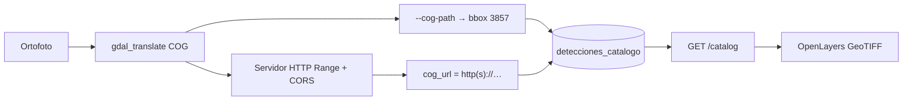

# COGs: construcción, catálogo y visibilidad en el mapa

Cómo preparar un **Cloud Optimized GeoTIFF (COG)**, cómo se guarda en PostgreSQL y qué hace falta para que el **visor** ([`frontend/`](../frontend/)) lo pinte como ortofoto de fondo.

La guía extremo a extremo (tiles → YOLO → CLIP → SQL) está en [`preparacion-de-datos.md`](preparacion-de-datos.md). Este documento se centra solo en el COG y el catálogo.

## Resumen (lo esencial)

| Pieza | Rol |
|-------|-----|
| Fichero `.tif` COG | Ortofoto de la capa; fuente del **bbox** del catálogo si pasas la ruta local a `embed2psql.py` |
| Columna `detecciones_catalogo.cog_url` | Referencia que expone `GET /catalog` y que el frontend usa para cargar la capa |
| Visor | Solo carga el COG si `cog_url` es una URL **`http://` o `https://`**, con **HTTP Range** y **CORS** |

Una ruta de disco (`D:\…\madrid.tif`) es válida para indexar y calcular el bbox, pero **no** se muestra en el mapa. Para ver la ortofoto hay que publicar el fichero y dejar en el catálogo una URL HTTP.



## 1. Construir el COG

Requisito: [GDAL](https://gdal.org/) ≥ 3.x con driver `COG`.

```powershell
gdalinfo --version
gdal_translate --formats | Select-String COG
```

### Comando recomendado

```powershell
gdal_translate `
  -of COG `
  -co COMPRESS=DEFLATE `
  -co PREDICTOR=2 `
  -co BLOCKSIZE=512 `
  -co OVERVIEWS=IGNORE_EXISTING `
  -co BIGTIFF=IF_SAFER `
  D:\datos\raw\ortofoto_aoi.tif `
  D:\datos\cog\capa_cog.tif
```

Variante JPEG (RGB más ligera; pérdida lossless):

```powershell
gdal_translate `
  -of COG `
  -co COMPRESS=JPEG `
  -co QUALITY=85 `
  -co BLOCKSIZE=512 `
  -co BIGTIFF=IF_SAFER `
  D:\datos\raw\ortofoto_aoi.tif `
  D:\datos\cog\capa_cog.tif
```

### Requisitos del fichero

- GeoTIFF **north-up** (tiepoint en píxel `(0,0)` + `ModelPixelScale`), típico tras `gdal_translate -of COG`.
- **Overviews** internas (`Overviews:` en `gdalinfo`) para zoom eficiente por HTTP Range.
- CRS georreferenciado (p. ej. ETRS89/UTM o EPSG:3857). El catálogo reproyecta el envelope a **EPSG:3857** al usar `--cog-path`.

Validación rápida:

```powershell
gdalinfo D:\datos\cog\capa_cog.tif
```

```powershell
cd D:\TFM\ares\tools
python -c "from pathlib import Path; from utils import cog_envelope_epsg3857_from_geotiff; print(cog_envelope_epsg3857_from_geotiff(Path(r'D:\datos\cog\capa_cog.tif')))"
```

## 2. Referencia en la base de datos

Tabla: `detecciones_catalogo` (schema en [`db/sql/detecciones_catalogo_schema.sql`](../db/sql/detecciones_catalogo_schema.sql)).

| Columna | Uso respecto al COG |
|---------|---------------------|
| `nombre_capa` | Nombre de la tabla de detecciones (p. ej. `madrid_detections_example`) |
| `bbox` | Polígono EPSG:3857 de la capa (preferente: geotags del COG vía `--cog-path`) |
| `cog_url` | **Texto** con la referencia del COG: ruta local **o** URL HTTP |

La API no sirve el raster: solo lee `cog_url` y lo devuelve en `GET /catalog`. Quien sirve el `.tif` es un servidor HTTP aparte (o un object store).

### Cómo se rellena (`embed2psql.py`)

| Flags | Qué se guarda en `cog_url` | Cómo se calcula `bbox` |
|-------|----------------------------|-------------------------|
| Solo `--cog-path` | Ruta absoluta local | Geotags del COG → 3857 |
| Solo `--cog-url` | La URL tal cual | Unión de tiles procesados (menos fiable) |
| **Ambos** | La **URL** (`--cog-url`) | Geotags del COG (`--cog-path`) |

Recomendado para datasets de prueba:

```powershell
cd D:\TFM\ares\tools
python embed2psql.py `
  --layer madrid_detections_example `
  --cog-path D:\datos\cog\capa_cog.tif `
  --cog-url http://127.0.0.1:4040/capa_cog.tif `
  --batch D:\datos\tiles16 `
  --output-dir D:\TFM\ares\sql_out `
  --strict
```

Si ya cargaste el catálogo con una ruta local, actualiza la URL:

```sql
UPDATE detecciones_catalogo
SET cog_url = 'http://127.0.0.1:4040/capa_cog.tif'
WHERE nombre_capa = 'madrid_detections_example';
```

Comprobación:

```sql
SELECT nombre_capa, cog_url, ST_AsText(bbox)
FROM detecciones_catalogo;
```

```powershell
# La API debe devolver cog_url con http(s)://
curl http://127.0.0.1:8000/catalog
```

## 3. Publicar el COG para el visor

El frontend (`ol.source.GeoTIFF`) solo acepta URLs que empiezan por `http://` o `https://` (`isHttpCogUrl`). Además el origen debe:

1. Responder **HTTP Range** (`Accept-Ranges: bytes`, respuestas `206` a peticiones parciales).
2. Enviar cabeceras **CORS** que permitan al origen del visor (p. ej. `http://127.0.0.1:3000`) leer el recurso (`Access-Control-Allow-Origin`, y en peticiones Range suele hacer falta exponer cabeceras de contenido).
3. Preferir **`127.0.0.1`** frente a `localhost` en Windows (el visor reescribe `localhost` → `127.0.0.1` para evitar fallos IPv6).

### Demostración local (puerto 4040)

Desde la carpeta que contiene el `.tif`:

```powershell
cd D:\datos\cog
# Opción A: Caddy (Range + CORS sencillos)
# Caddyfile de ejemplo:
# :4040 {
#     header Access-Control-Allow-Origin *
#     header Access-Control-Expose-Headers Content-Length,Content-Range,Accept-Ranges
#     file_server browse
# }
caddy run --config Caddyfile
```

Con **nginx**, sirve el directorio de COGs y deja Range (activo en estáticos) más CORS:

```nginx
location /cogs/ {
    alias /var/www/cogs/;
    types { image/tiff tif tiff; }
    default_type image/tiff;
    add_header Access-Control-Allow-Origin *;
    add_header Access-Control-Expose-Headers "Content-Length,Content-Range,Accept-Ranges";
}
```

Object store (MinIO / S3 / R2): bucket de lectura pública o URL firmada; verifica Range y CORS en la consola del proveedor.

### Comprobar Range y CORS

```powershell
curl -I "http://127.0.0.1:4040/capa_cog.tif"
# Esperado: Accept-Ranges: bytes

curl -H "Range: bytes=0-1023" -I "http://127.0.0.1:4040/capa_cog.tif"
# Esperado: HTTP/1.1 206 Partial Content

curl -H "Origin: http://127.0.0.1:3000" -I "http://127.0.0.1:4040/capa_cog.tif"
# Esperado: Access-Control-Allow-Origin …
```

`python -m http.server` **no** basta en el navegador: Range es limitado y no envía CORS. Úsalo solo para comprobar descarga, no para el mapa.

## 4. Qué hace el visor

1. `GET /catalog` → lista de capas con `cog_url` y `bbox`.
2. Si `cog_url` es HTTP(S), crea una capa `WebGLTile` + `GeoTIFF` y la muestra bajo las detecciones.
3. Si es ruta local, vacío o no HTTP → la capa **no** se carga (las detecciones sí; el basemap OSM/satélite sigue disponible).
4. El ajuste de vista prioriza el extent nativo del GeoTIFF; si falla Range/CORS, cae al `bbox` del catálogo.

En el control de catálogo, una capa sin URL HTTP no ofrece ortofoto usable aunque el índice de detecciones esté bien.

El visor de testing ([`api_webviewer/`](../api_webviewer/)) tiene el mismo criterio: solo carga COGs con URL HTTP + Range + CORS.

## 5. Checklist «quiero ver la ortofoto»

1. `gdalinfo` del COG OK (CRS + overviews).
2. Servidor HTTP sirve el `.tif` con **Range** (`206`) y **CORS**.
3. `detecciones_catalogo.cog_url` es `http://…` o `https://…` (no `D:\…`).
4. `GET /catalog` devuelve esa URL.
5. Frontend en marcha; en el mapa, la capa del catálogo visible → ortofoto bajo las detecciones.

Si las búsquedas funcionan pero no hay ortofoto: casi siempre es (2) o (3).

## Ver también

- Pipeline completo: [`preparacion-de-datos.md`](preparacion-de-datos.md) (§2–3 COG y publicación; §7 `embed2psql`)
- Modelo de datos: [`db/README.md`](../db/README.md)
- CLI: [`tools/README.md`](../tools/README.md) (`embed2psql.py --cog-path` / `--cog-url`)
- Uso del mapa: [`guia-de-uso.md`](guia-de-uso.md)
