# Descripción de la solución

> Sección central de la memoria técnica: arquitectura, componentes, flujos de datos y justificación tecnológica.

ARES se organiza en **dos planos temporales** que comparten un único índice en PostgreSQL:

1. **Offline (indexación)** — transforma ortofoto → detecciones YOLO → embeddings CLIP → filas PostGIS/pgvector.
2. **Online (consulta)** — interpreta lenguaje natural → embebe texto → recupera entidades → GeoJSON → mapa/tabla.

Esta separación es deliberada: el coste de visión por computador se asume por lotes; la interacción del usuario trabaja sobre un índice ya materializado, con latencias compatibles con un visor web.

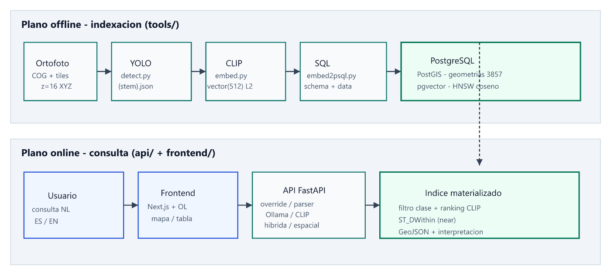

*Figura 4.1 — Planos offline y online unidos por el índice espacial-vectorial.*

---

## Arquitectura general

### Visión de conjunto

```text
Ortofoto / COG
    → tiles XYZ (z=16)
    → YOLO  (geometría + clase + confianza)
    → CLIP  (embedding imagen 512-d, L2)
    → PostgreSQL (PostGIS + pgvector)
    → API FastAPI  (interpretación + búsqueda)
    → Frontend / cliente GeoJSON
```

El sistema no intenta «entender la ortofoto» en cada petición HTTP. En su lugar:

- **Materializa entidades** (polígonos en EPSG:3857) con semántica de clase y vector CLIP.
- **Traduce la consulta** a una estructura tipada (`StructuredQuery`: intent, clases candidatas, atributos, *target*/*reference*).
- **Ejecuta una estrategia de recuperación** acotada: híbrida (clase + ranking) o espacial (`ST_DWithin`).
- **Devuelve evidencia** (features + `metadata.interpretation` + *timings*) para que el usuario valide la intención.

### Principios de diseño

| Principio | Manifestación en ARES |
|-----------|------------------------|
| Separación offline / online | `tools/` indexa; `api/` consulta; no se mezcla inferencia YOLO en el request path |
| Dependencias hacia el dominio | Clean Architecture en `api/` (detalle en §05) |
| LLM como último recurso | Orden fijo: overrides → parser determinista → Ollama |
| Semántica multimodal acotada | CLIP solo sobre *target* + atributos; el espacial lo resuelve PostGIS |
| Contrato cartográfico estándar | GeoJSON `FeatureCollection` en EPSG:3857 |
| Operabilidad local / CPU | Pesos y modelos en infra propia; GPU opcional |

---

## Modelo de datos e índice

Antes de detallar componentes conviene fijar el **contrato de persistencia**, porque condiciona detección, embedding y búsqueda.

### Catálogo de capas

Tabla `detecciones_catalogo` (nombre configurable):

| Campo | Rol |
|-------|-----|
| `nombre_capa` | Identificador único; coincide con el nombre de la tabla de detecciones |
| `bbox` | Extensión de la capa (`GEOMETRY(Polygon,3857)`) |
| `cog_url` | URL del Cloud Optimized GeoTIFF (HTTP Range) para contexto en el visor |
| `total_detecciones` / `total_tiles` | Estadísticas de carga |
| `metadata` | JSONB auxiliar |

El catálogo permite a la API **descubrir dinámicamente** qué tablas consultar (`GET /catalog`) sin hardcodear capas.

### Tabla de detecciones (por capa)

Cada capa materializa filas con, como mínimo:

| Campo | Tipo / notas |
|-------|----------------|
| `id` | Clave primaria |
| `tile_id` | `"z/x/y"` (p. ej. `16/32101/24711`) |
| `clase_yolo` | Etiqueta canónica del detector |
| `modelo_deteccion` | Origen del peso YOLO |
| `confianza` | Score del detector |
| `geom` | `GEOMETRY(Polygon,3857)` — bbox proyectado |
| `embedding` | `vector(512)` — CLIP imagen, normalizado L2 |
| `metadata` | JSONB (detalle de bbox, etc.) |

**Índices típicos:** GIST sobre `geom`; HNSW sobre `embedding` con `vector_cosine_ops`; btree sobre `modelo_deteccion`.

La elección de **EPSG:3857** simplifica distancias en metros a la escala urbana del dataset de prueba (Madrid) y alinea tiles Web Mercator (`gdal2tiles`) con la geometría almacenada.

---

## Componente 1 — Procesamiento de imágenes (pipeline offline)

### De la ortofoto al tile

El dataset de trabajo no es el GeoTIFF monolítico en crudo, sino un **mosaico de teselas** en zoom 16 (layout XYZ de `gdal2tiles`, tamaño de tile habitual 2048 px). Motivos técnicos:

1. YOLO opera sobre ventanas de tamaño acotado (`imgsz` típico 1280).
2. La ruta `…/z/x/y.ext` permite derivar `tile_id` y `bbox3857` de forma determinista.
3. El procesamiento es paralelizable por fichero y reanudable (`--skip-existing`).

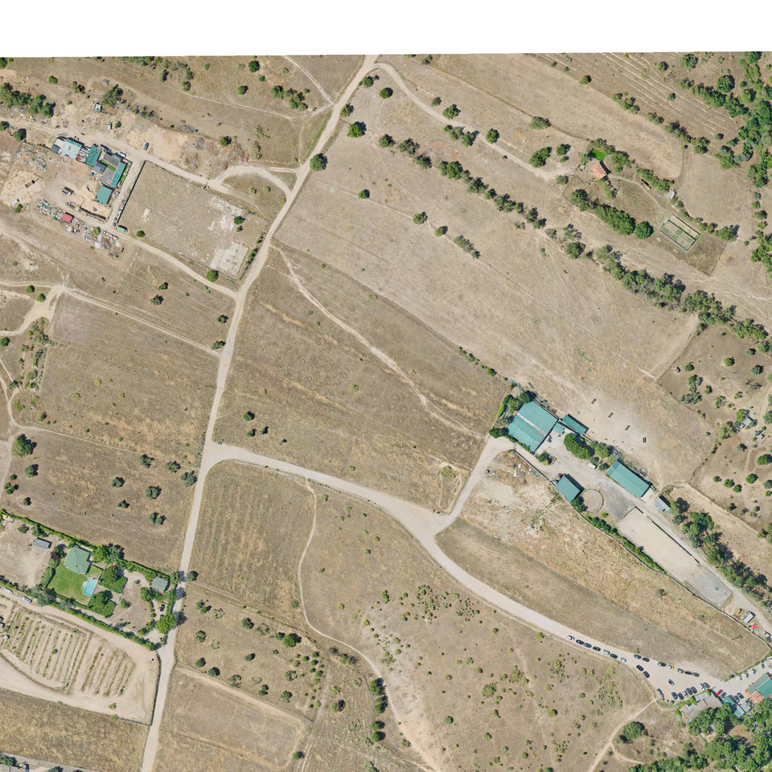

*Figura 4.2 — Tesela de entrada del pipeline (vista previa). Fuente: `madrid_orto_2024_sur` / layout `16/32091/24688`.*

Sin layout `z/x/y`, `detect.py` no puede georreferenciar detecciones y `embed2psql.py` no construye un `tile_id` válido. El detalle operativo (COG, HTTP Range, `gdal2tiles`) está en [`doc/preparacion-de-datos.md`](../preparacion-de-datos.md).

### Detección multi-modelo (YOLO)

`detect.py` ejecuta uno o varios pesos (`--all-models`) sobre cada tile y escribe un companion `{stem}.json` con:

- `class_name`, `confidence`, `source_model`
- `bbox` en píxeles del tile
- `bbox3857` proyectado (cuando la ruta es un tile gdal2tiles válido)
- soporte AABB y OBB según el modelo

Modelos del stack activo (`CONFIGURED_MODELS` / `--all-models`):

| Modelo | Especialización | Por qué no lo cubre un detector genérico |
|--------|-----------------|------------------------------------------|
| `visdrone-yolov11s` | Vehículos y objetos pequeños (VisDrone) | Escala fina, vista cenital/oblicua tipo drone; COCO/DOTA genéricos fallan en coches densos |
| `yolo-remote-sensing-photovoltaic` | Paneles solares | Textura geométrica y radiométrica específica; rara en taxonomías urbanas genéricas |
| `building-detector` | Edificaciones (segmentación → footprint) | Huellas grandes y compactas; umbral `conf` más alto (0,35) para reducir falsos positivos |
| `swimming-pool-detector` | Piscinas | Clase minoritaria y visualmente confusa con sombras/agua; conviene un peso dedicado |
| `yolo11m-obb.pt` | Objetos rotados (DOTA OBB), p. ej. campos deportivos | Requiere **cajas orientadas**; un YOLO AABB único no representa bien ejes no alineados al tile |

La inferencia es **operable en CPU**; la GPU acelera pero no es requisito de arquitectura. Con `--all-models` y tiles 2048×2048 se aplican `imgsz`/`conf` **por modelo** (`MODEL_INFERENCE_DEFAULTS`), no un único hiperparámetro global.

#### Justificación técnica: ¿por qué varios YOLO y no un modelo único?

Un detector monolítico (un solo `.pt` con todas las clases) sería más simple de operar, pero **no es el óptimo técnico** para el perfil de ARES. Las razones son de dominio, geometría, datos de entrenamiento y economía del pipeline offline.

**1. Desajuste de dominio (*domain shift*) entre clases**

Las clases objetivo no comparten la misma estadística visual ni el mismo corpus de entrenamiento público:

- Un coche en ortofoto de 25 cm/px es un objeto **pequeño y denso**; VisDrone está diseñado para eso.
- Un edificio es un footprint **grande**; el detector de edificios se entrena y se umbraliza distinto.
- Un panel fotovoltaico es un patrón de **textura/estructura** poco representado en datasets urbanos genéricos.
- Una piscina es una clase **rara** y fácil de confundir con espejos de agua o sombras.

Forzar todas esas clases en un único peso implica, en la práctica, o bien **reentrenar** un modelo multi-clase propio (coste de dataset etiquetado + validación fuera del alcance del TFM), o bien aceptar un detector «todoterreno» con recall desigual. El ensamblado de **especialistas preentrenados** reutiliza el mejor peso disponible por familia semántica sin etiquetar de cero.

**2. Geometría de salida distinta (AABB vs OBB)**

No todas las entidades se representan bien con cajas axis-aligned. Campos deportivos, naves o elementos alargados en vista cenital encajan en **OBB** (DOTA / `yolo11m-obb`). Un modelo único AABB distorsiona el área, contamina el crop enviado a CLIP y degrada tanto el índice espacial como el ranking semántico. Mantener un peso OBB en el stack permite elegir la representación geométrica adecuada **por tipo de objeto**, no por compromiso global.

**3. Hiperparámetros e imágenes de entrada no homogéneos**

Cada especialista admite (y necesita) su propio equilibrio `imgsz` / `conf`. En el stack actual, el detector de edificios usa `conf=0,35` frente a `0,25` en el resto: un umbral único o bien inunda el índice de falsos edificios, o bien pierde vehículos y paneles. El multi-modelo permite **calibrar por clase** sin recompilar un único checkpoint.

**4. Modularidad y evolución del catálogo**

Añadir «paneles solares» o «piscinas» al producto no exige reentrenar un megamodelo ni invalidar pesos previos: se incorpora un alias a `CONFIGURED_MODELS`, se re-ejecuta el batch (`--skip-existing`) y las nuevas filas llevan `modelo_deteccion` / `source_model` trazable. Quitar o sustituir un especialista es simétrico. Un modelo único acopla el ciclo de vida de **todas** las clases a un solo reentrenamiento.

**5. El coste extra es offline y aceptable**

Pasar N modelos por tile multiplica el tiempo de indexación, pero:

- ocurre **una vez por campaña** (o de forma incremental), no en cada `POST /search`;
- el plano online solo lee el índice ya fusionado;
- en CPU sigue siendo viable a escala de AOI de prueba (como muestran las capturas de batch).

Es decir: se paga complejidad y tiempo **donde es barato para la UX** (indexado), a cambio de mejor cobertura por clase en consulta.

**6. Qué se gana en el índice y en la búsqueda**

| Beneficio | Efecto en ARES |
|-----------|----------------|
| Mejor recall por familia semántica | Más entidades recuperables para consultas del tipo «piscinas», «paneles solares», «coches» |
| Crops más limpios para CLIP | Embeddings más discriminativos (menos fondo / menos bbox mal orientado) |
| Geometrías más fieles en PostGIS | `ST_DWithin` y distancias más realistas sobre footprints correctos |
| Procedencia por modelo | Auditoría y depuración (`source_model` / `modelo_deteccion`) |
| Catálogo API alineado a clases reales | El parser/LLM mapea a `clase_yolo` que **existen** porque un especialista las produjo |

**7. Costes y mitigaciones del enfoque multi-modelo**

| Coste | Mitigación en el diseño |
|-------|-------------------------|
| Tiempo de batch × N modelos | `--skip-existing`, AOI acotada, GPU opcional, posibilidad de correr un solo `--model` |
| Posibles solapes entre detectores | Fusión en JSON/SQL por capa; filtros de confianza en API/visor; catálogo canónico en búsqueda |
| Vocabulario de clases heterogéneo (`car` vs `small vehicle`, etc.) | Catálogo YOLO de la API + ranking CLIP; el usuario no elige el peso, elige la frase |
| Operación más compleja | Un solo CLI (`detect.py --all-models`) encapsula el ensamblado |

En resumen: **no se usa un modelo único porque las clases objetivo no son un problema de detección homogéneo**. Son subproblemas con datos, escalas, geometrías y umbrales distintos. El ensamblado de YOLO especializados maximiza la calidad del índice materializado —que es la materia prima de toda búsqueda posterior— sin exigir un reentrenamiento multi-clase propio ni degradar la latencia online.

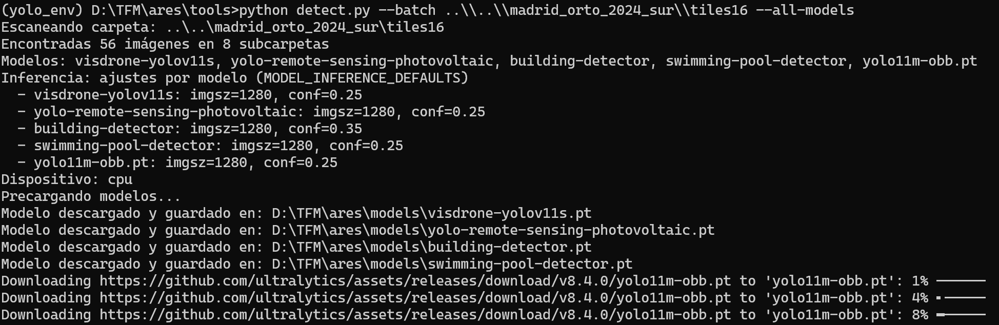

*Figura 4.3 — Arranque del batch de detección: escaneo de tiles y carga de la batería de modelos.*

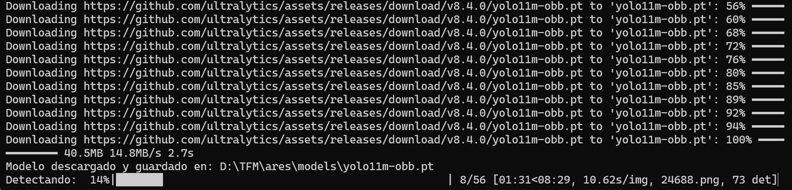

*Figura 4.4 — Inferencia en curso: densidad de detecciones por tile y coste temporal en CPU.*

A partir del JSON de detecciones se puede materializar una vista de control de calidad. La figura siguiente muestra un **overlay sintético** de cajas sobre la misma tesela (muestra de hasta 80 detecciones del companion JSON):

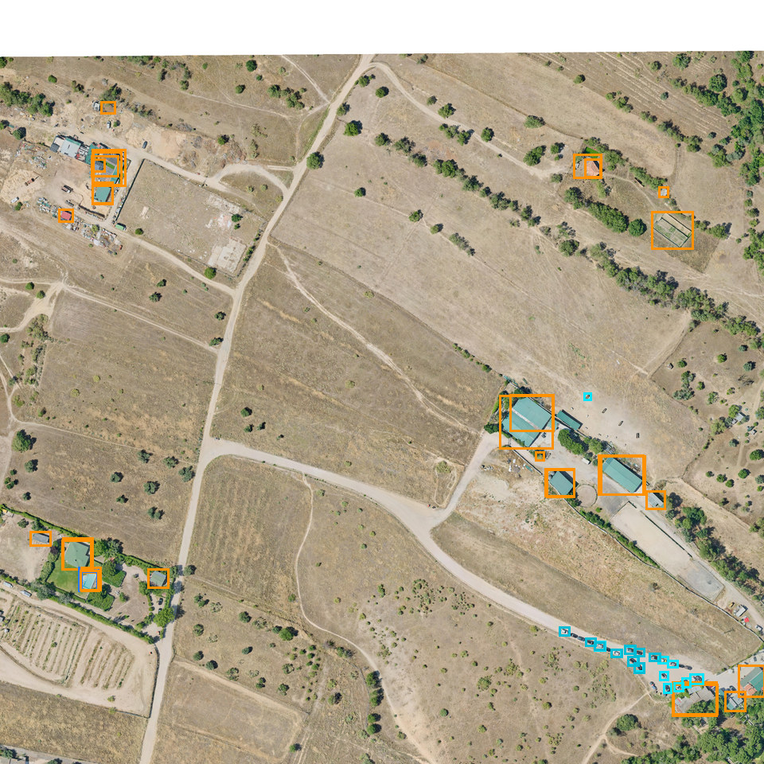

*Figura 4.5 — Control visual de detecciones (AABB) sobre el tile `16/32091/24688`. Muestra de las detecciones con mayor confianza; útil antes de embeber y cargar a BD.*

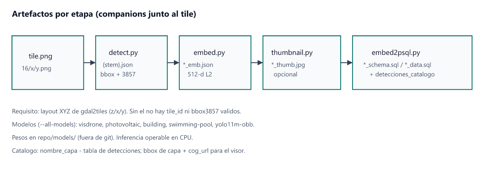

*Figura 4.6 — Cadena de artefactos companion junto a cada tile.*

### Embeddings CLIP

`embed.py` recorta cada detección por su bbox, pasa el crop por **CLIP imagen** (`openai/clip-vit-base-patch32` / `clip-ViT-B-32`) y persiste vectores **512-d normalizados L2** en `{stem}_emb.json`.

Decisiones relevantes:

- Misma familia CLIP en indexado (imagen) y en consulta (texto) → espacio compartido.
- Un tile produce **muchas** filas de embedding (una por detección), no un único vector de escena.
- `--skip-existing` y resúmenes batch permiten reanudar campañas largas.

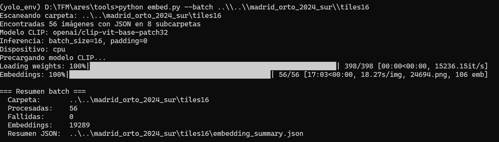

*Figura 4.7 — Ejemplo real de campaña de embeddings: 56 tiles → ~19k vectores en CPU.*

### Thumbnails y carga SQL

- `thumbnail.py` genera JPEG 512×512 (`*_thumb.jpg`) para previsualización; **no** sustituye al embedding ni entra como columna obligatoria de búsqueda.
- `embed2psql.py` une geometría + embedding + metadatos, emite `*_schema.sql` / `*_data.sql` y actualiza el catálogo (`nombre_capa`, `cog_url`, bbox, contadores).
- La carga final es `psql -f …` sobre la BD `detecciones` (PostGIS + pgvector).

`visualize.py` (GUI PyQt6) es herramienta de QA local; **no** forma parte del camino de indexado productivo.

---

## Componente 2 — Indexación semántica y espacial

Una vez cargado el SQL, el índice ofrece tres capacidades ortogonales:

1. **Filtro categórico** por `clase_yolo` (lista canónica alineada con el catálogo de la API).
2. **Ranking semántico** por distancia coseno pgvector (`embedding <=> query_vec`).
3. **Predicado espacial** PostGIS (`ST_DWithin`, `ST_Distance`, serialización `ST_AsGeoJSON`).

La API no inventa geometrías en consulta: solo **selecciona y ordena** filas ya georreferenciadas. Eso limita el universo recuperable a lo detectado offline —*trade-off* consciente ya descrito en la introducción— a cambio de latencia y control.

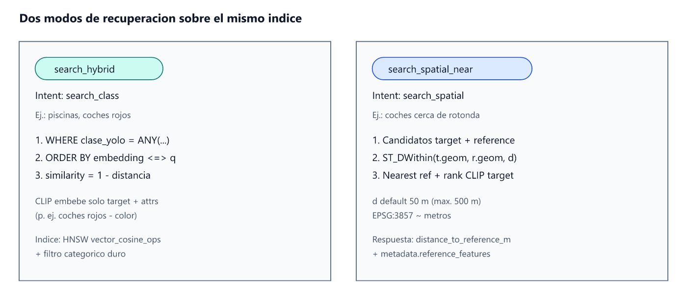

*Figura 4.8 — Dos modos de recuperación sobre el mismo esquema de tablas.*

---

## Componente 3 — API de consulta

La API REST (`api/`, FastAPI) expone la búsqueda sobre el índice ya materializado. A nivel de **solución** importa:

- Interpretación en cascada: overrides HTTP → parser determinista → Ollama (solo si hace falta).
- CLIP sobre *target* + atributos (no sobre la frase espacial completa).
- Recuperación híbrida o espacial (`ST_DWithin`) según el intent.
- Respuesta GeoJSON con `metadata.interpretation` auditable.

Si CLIP recibiera «coches cerca de rotonda» como un único string, mezclaría semántica de *target* y *reference*. ARES descompone el problema: CLIP ordena el target; PostGIS aplica la proximidad.

El detalle de **Clean Architecture**, composition root, caso de uso, adaptadores y contrato GeoJSON se desarrolla en el [capítulo 05 · Implementación](05-implementacion.md).

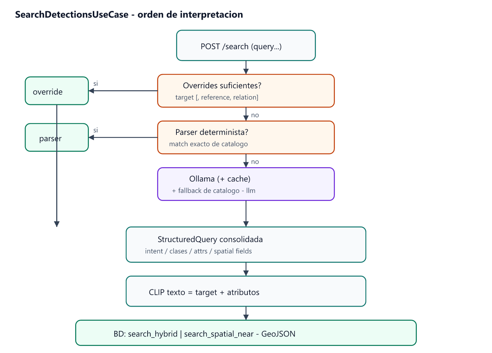

*Figura 4.9 — Orden de interpretación (detalle de ingeniería en §05).*

Endpoints: `POST /search`, `GET /catalog`, `GET /health`, gestión de caché LLM. Referencia operativa: [`api/README.md`](../../api/README.md).

---

## Componente 4 — Visor cartográfico

El frontend de producto (`frontend/`, Next.js + OpenLayers) consume el GeoJSON y hace explícita la interpretación. Piezas de UX:

| Pieza | Función |
|-------|---------|
| Zona de consulta | Texto libre, chips de ejemplo, top‑k, filtro de baja confianza, i18n |
| Mapa / tabla | Geometrías por confianza; selección cruzada; referencias espaciales |
| Interpretación | Intent, *target*/*reference*, texto CLIP, fuente, *timings* |
| Filtros / catálogo | Clase, confianza, similitud, capas COG |

La **arquitectura de componentes y estado** del frontend está en el [capítulo 05](05-implementacion.md). Aquí se documenta el resultado visible:

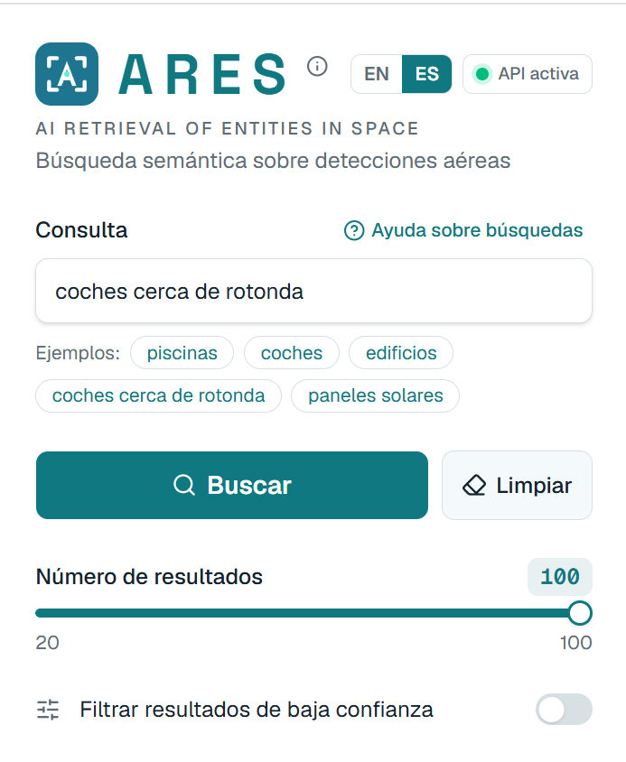

*Figura 4.10 — Entrada de consulta NL y chips de ejemplo (incl. espacial «coches cerca de rotonda»).*

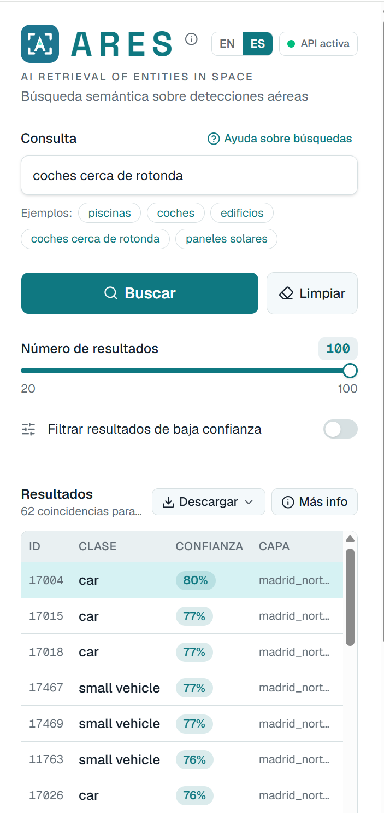

*Figura 4.11 — Consulta espacial resuelta: coincidencias, tabla con clase y confianza.*


*Figura 4.12 — Resultado cartográfico: geometrías, leyenda, filtros y catálogo de capas.*

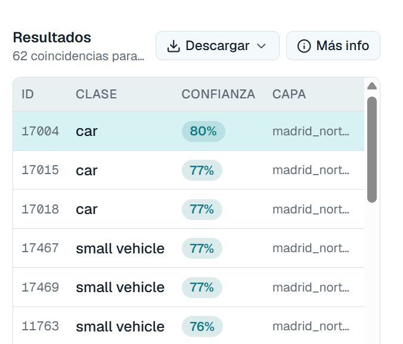

*Figura 4.13 — Lectura tabular alineada con el mapa.*

`api_webviewer/` es un visor **secundario** de testing del contrato HTTP (mapa, tabla, JSON crudo), no la UX de producto.

---

## Flujos de extremo a extremo (síntesis)

### A) Indexar una zona nueva

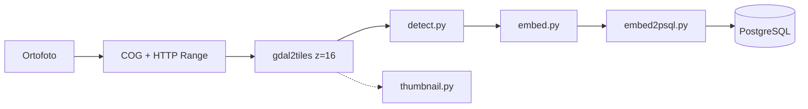

### B) Resolver una consulta de usuario

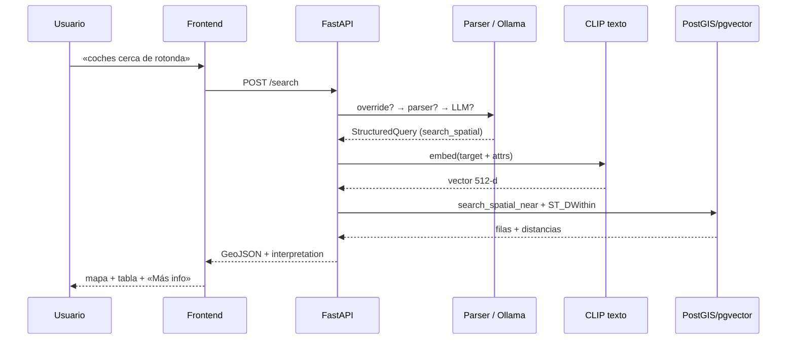

La secuencia B se desglosa a nivel de clases y puertos en el capítulo 05.
---

## Tecnologías empleadas y justificación

| Tecnología | Rol en ARES | Por qué encaja |
|------------|-------------|----------------|
| **YOLO (Ultralytics)** | Detección batch multi-clase / OBB sobre tiles | Maduro en remote sensing; pesos especializados; CLI sencilla; CPU viable |
| **CLIP ViT-B/32** | Espacio compartido imagen (offline) / texto (online) | Dimensión 512 manejable; buen compromiso calidad/coste; atributos no tabulados (color) |
| **PostgreSQL + PostGIS** | Geometrías, `ST_DWithin`, GeoJSON | Estándar de facto espacial; distancias y joins fiables |
| **pgvector (HNSW)** | Ranking coseno sobre embeddings | Mismo motor SQL; evita un segundo almacén vectorial |
| **Ollama + llama3.2:3b** | Interpretación NL → estructura tipada | Local, modelo pequeño, sin API cloud; complementado por parser |
| **FastAPI + asyncpg** | API REST async | Tipado Pydantic, OpenAPI, buen encaje con asyncpg |
| **Next.js + OpenLayers** | Visor de producto | OL nativo para GeoJSON 3857; Next para UX moderna |
| **GDAL / gdal2tiles** | COG y teselas XYZ | Interoperabilidad con ortofotos oficiales y visores web |
| **Python** | Pipeline + API | Ecosistema CV + geo + web unificado |

### Alternativas descartadas (resumen)

| Alternativa | Motivo de no adopción como camino feliz |
|-------------|----------------------------------------|
| Detección online por petición | Latencia y coste inaceptables para UX interactiva |
| Solo CLIP sin filtro de clase | Exceso de falsos positivos; pérdida de control categórico |
| Solo filtros GIS / SQL tipado | No cumple el objetivo de lenguaje natural |
| LLM cloud + visión cloud | Privacidad, coste recurrente, dependencia de proveedor |
| NL2SQL libre | Fragilidad y riesgo sin *grounding* en catálogo YOLO |
| Relación espacial vía CLIP | Confunde *target* y *reference* en el embedding |

---

## Límites del diseño actual (anclaje técnico)

Quedan fuera o parcialmente preparados, de forma coherente con el alcance:

- Relaciones `inside` / `within` (schema preparado; sin implementación operativa).
- Filtro `bbox` como fase de producto adicional.
- Caché LRU amplia de interpretaciones Ollama (existe soporte básico de cache; no es el foco de producto).
- Evaluación cuantitativa formal (precision/recall por tipo de consulta).

Estos límites no alteran la arquitectura descrita: el esqueleto (offline materializado + online híbrido/espacial + interpretación auditable) permanece estable para evoluciones posteriores.

---

## Resumen del capítulo

ARES implementa una **arquitectura de recuperación semántico-espacial en dos tiempos**: pipeline offline (YOLO → CLIP → PostGIS/pgvector) y plano online (interpretación local → CLIP texto → consulta híbrida o `ST_DWithin` → GeoJSON → visor). Este capítulo fija el diseño de solución, los componentes y la justificación tecnológica; el **detalle de ingeniería de software** (capas, DI, caso de uso, tests) se desarrolla en el [capítulo 05](05-implementacion.md).
