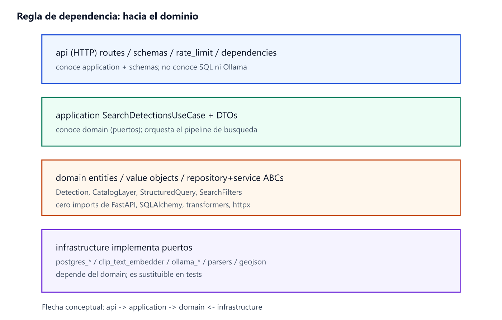
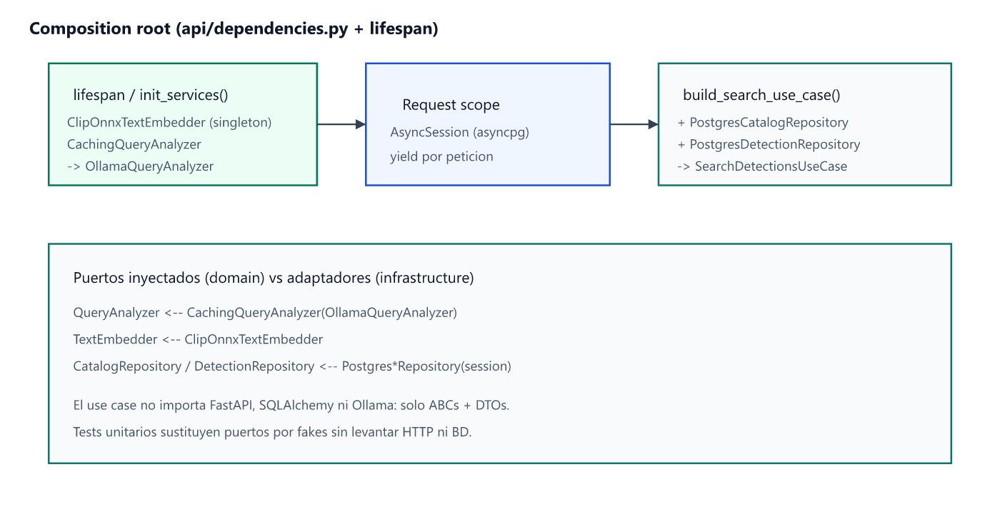
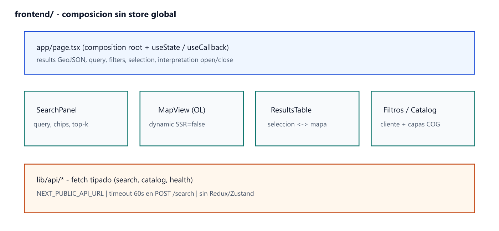

# Implementación

> Decisiones de diseño e implementación a nivel de ingeniería de software.  
> El *qué* y el *porqué* de producto están en el capítulo 04; aquí se detalla el *cómo* se construye el código.

Este capítulo se centra en la **arquitectura software de la API y del frontend**, el **composition root**, los **contratos de dominio**, el **pipeline del caso de uso**, los **adaptadores** (BD, CLIP, Ollama, parsers) y las **prácticas de prueba y configuración**. El pipeline offline (`tools/`) se trata como módulo de implementación batch, sin repetir la justificación multi-modelo del capítulo anterior. La frontera online/offline se mantiene en código: ningún import de Ultralytics entra en el request path de `api/`.

---

## Arquitectura software de la API (Clean Architecture)

### Capas y regla de dependencia

La API aplica Clean Architecture con **dependencias hacia el dominio**:



*Figura 5.1 — `api` → `application` → `domain` ← `infrastructure`.*

| Paquete | Contenido típico | Puede depender de |
|---------|------------------|-------------------|
| `domain/` | `Detection`, `CatalogLayer`, `StructuredQuery`, `SearchFilters`; ABCs `DetectionRepository`, `CatalogRepository`, `QueryAnalyzer`, `TextEmbedder` | Solo tipado / Pydantic de VO |
| `application/` | `SearchDetectionsUseCase`, DTOs | `domain` |
| `infrastructure/` | Postgres, CLIP, Ollama, parsers, GeoJSON | `domain` (+ libs externas) |
| `api/` (HTTP) | routes, schemas Pydantic, rate limit, `dependencies.py` | `application` (+ FastAPI) |

El dominio **no** importa FastAPI, SQLAlchemy, `transformers` ni `httpx`. Eso permite:

1. Sustituir Ollama por otro analizador sin tocar el use case.
2. Probar el pipeline con fakes de puertos.
3. Evolucionar el esquema HTTP sin contaminar reglas de negocio.

La figura de capas del capítulo 04 (Clean Architecture) se concreta aquí en **paquetes Python reales** bajo `api/`.

### Árbol relevante

```text
api/
├── main.py, config.py
├── api/                     # delivery HTTP
│   ├── dependencies.py      # composition root
│   ├── routes/              # health, catalog, search, cache
│   ├── schemas/search.py
│   └── rate_limit.py
├── application/
│   ├── dto/search_dto.py
│   └── use_cases/search_detections.py
├── domain/
│   ├── entities/
│   ├── value_objects/       # StructuredQuery, SearchFilters
│   ├── repositories/        # ABC
│   └── services/            # ABC QueryAnalyzer, TextEmbedder
├── infrastructure/
│   ├── ai/                  # ollama, clip, parsers, cache, catalogs
│   ├── db/                  # session, postgres_* repositories
│   └── geo/geojson_serializer.py
└── tests/
```

### Composition root e inyección de dependencias

El cableado no se esparce por los routers: vive en `api/dependencies.py` y en el **lifespan** de FastAPI.



*Figura 5.2 — Singletons de IA en lifespan; sesión BD y use case por petición.*

Decisiones de ingeniería:

| Decisión | Implementación | Motivo |
|----------|----------------|--------|
| CLIP y Ollama como **singletons** | `init_services()` en lifespan | Carga de pesos / cliente cara; amortizar entre requests |
| Sesión BD **por request** | `async with async_session_factory()` + `yield` | Aislamiento, pool asyncpg, ciclo de vida claro |
| Use case **por request** | `build_search_use_case(session)` | Repos ligados a la sesión; sin estado mutable compartido |
| Analizador con **decorador de caché** | `CachingQueryAnalyzer(OllamaQueryAnalyzer(), maxsize=…)` | LRU de interpretaciones; el use case sigue viendo el puerto `QueryAnalyzer` |
| Drivers async | SQLAlchemy + **asyncpg** | Encaje natural con `async def` de FastAPI |

```python
# Esquema conceptual (api/dependencies.py)
_services = AppServices(
    text_embedder=ClipOnnxTextEmbedder(),
    query_analyzer=CachingQueryAnalyzer(
        OllamaQueryAnalyzer(),
        maxsize=settings.llm_cache_maxsize,
    ),
)

def build_search_use_case(session: AsyncSession) -> SearchDetectionsUseCase:
    return SearchDetectionsUseCase(
        query_analyzer=get_services().query_analyzer,
        text_embedder=get_services().text_embedder,
        catalog_repository=PostgresCatalogRepository(session),
        detection_repository=PostgresDetectionRepository(session),
    )
```

Los routers solo conocen schemas Pydantic y el use case construido por DI; no instancian adaptadores a mano.

---

## Modelo de dominio (contratos tipados)

### `StructuredQuery` — salida normalizada de la interpretación

Definido en `domain/value_objects/semantic_query.py` (Pydantic). Es el **DTO de dominio** entre interpretación y recuperación:

| Grupo | Campos | Uso |
|-------|--------|-----|
| Intent | `intent`: `search_class` \| `search_spatial` \| … | Elige `search_hybrid` vs `search_spatial_near` |
| Etiqueta | `object_label`, `canonical_label`, `clase_yolo_candidates` | Búsqueda por clase |
| Atributos | `attributes` (p. ej. color) | Entran en el texto CLIP, no en SQL de clase |
| Espacial | `relation`, `distance_m`, `target_*`, `reference_*` | Self-join + `ST_DWithin` |
| Auditoría | `reasoning`, `detected_language` | Interpretación visible |

Helpers de diseño (`effective_target_classes()`, `effective_reference_classes()`, …) evitan duplicar lógica «¿miro `target_clase_yolo` o `clase_yolo_candidates`?» en el use case y en el serializador.

Intents/relaciones **preparados pero no operativos** (`search_attribute`, `inside`) se rechazan en validación del use case: el schema anticipa evolución sin abrir caminos a medias en producción.

### `Detection` y `CatalogLayer`

- **`Detection`**: identidad (`id`, `layer`, `tile_id`), semántica (`clase_yolo`, `modelo_deteccion`, `confianza`), ranking (`similarity`), geometría ya serializable (`geom_geojson`), y campos espaciales opcionales (`distance_to_reference_m`, `reference_id`, geometría/clase de referencia).
- **`CatalogLayer`**: metadatos de capa (`nombre_capa`, `cog_url`, bbox, contadores) para descubrimiento dinámico de tablas.

El use case trabaja con estas entidades; el SQL y el GeoJSON son detalles de adaptador.

### `SearchFilters` y DTOs de aplicación

`SearchRequestDTO` / `SearchResponseDTO` (`application/dto/`) acotan lo que la capa de aplicación acepta (query, top_k, overrides espaciales, umbrales). La capa HTTP mapea schemas ↔ DTO; así FastAPI puede cambiar sin rearrastrar el dominio.

---

## Caso de uso: `SearchDetectionsUseCase`

Orquestador único en `application/use_cases/search_detections.py`. **No** contiene SQL ni prompts: solo política de interpretación y llamada a puertos.


*Figura 5.3 — Pipeline obligatorio: override → parser → LLM → CLIP → BD → GeoJSON.*

### Pseudocódigo de control

```text
execute(request):
  structured, source ← from_overrides(request)          # 1
  if structured is None:
      structured ← try_deterministic_parse(query)       # 2
      source ← parser | None
  if structured is None:
      structured ← await query_analyzer.analyze(query)  # 3 (+ cache)
      source ← llm | cache
  structured ← apply_partial_overrides(structured, request)
  validate(structured)                                  # intent/relation soportados
  distance_m ← resolve_distance(structured, request)
  text ← build_clip_embedding_text(structured)          # target + attrs
  vec ← text_embedder.embed_text(text)
  layers ← catalog.list_layers()
  if intent == search_spatial:
      rows ← detections.search_spatial_near(...)
  else:
      rows ← detections.search_hybrid(...)
  return GeoJsonSerializer.to_feature_collection(...)
```

### Por qué este orden es código, no solo documentación

| Paso | Beneficio de ingeniería |
|------|-------------------------|
| Overrides primero | Clientes (tests, UI avanzada, scripts) pueden *bypassear* NL de forma tipada |
| Parser antes que LLM | Latencia predecible (`llm_ms=0`), determinismo, menos flaky tests |
| LLM al final | Solo ambiguas; modelo pequeño local (`llama3.2:3b`) |
| CLIP después de estructurar | El texto embebido no depende de la frase espacial cruda |
| Una sola serialización | Contrato GeoJSON estable para todos los clientes |

Romper el orden (p. ej. llamar siempre a Ollama) invalidaría el fast-path y los tests que asumen `source=parser|override`.

### Construcción del texto CLIP

`build_clip_embedding_text` (`infrastructure/ai/attribute_catalog.py`) concatena **target + atributos**. Ejemplo: consulta «coches rojos cerca de rotonda» → texto tipo «coches rojos» (o canónico equivalente), no la frase completa. La proximidad la resuelve PostGIS. Esta decisión se verifica en tests del use case (`test_search_use_case.py`).

### Validaciones y errores

- Overrides incompletos (p. ej. `spatial_relation` sin `reference`) no fabrican un `StructuredQuery` a medias.
- Targets/referencias no mapeables a catálogo → `SearchValidationError` (HTTP 4xx vía capa API).
- Intents no implementados → rechazo explícito, no *fallback* silencioso a híbrida.

---

## Adaptadores de infraestructura

### Persistencia — `PostgresDetectionRepository`

SQL dinámico **por capa** (`validate_layer_name` evita inyección vía nombre de tabla):

**Híbrida (`search_hybrid`)**

1. `WHERE clase_yolo = ANY(:classes)` (+ umbral de confianza si aplica).
2. `ORDER BY embedding <=> :query_vec` (distancia coseno pgvector).
3. `similarity = 1 - distance`.
4. Fusión multi-capa en Python: merge + sort global por similitud / top_k.

**Espacial (`search_spatial_near`)**

1. Self-join lógico target/reference sobre la misma tabla de capa (o conjuntos de clases).
2. `ST_DWithin(t.geom, r.geom, :distance_m)` en EPSG:3857.
3. `DISTINCT ON (t.id)` quedándose con la referencia más cercana + `ST_Distance`.
4. Ranking CLIP sobre el target (mismo vector de texto).

El repositorio **mapea filas → `Detection`**, incluyendo GeoJSON de geometría vía `ST_AsGeoJSON`. El use case no ve cursores.

Índices asumidos en implementación (creados por `embed2psql.py`): GIST(`geom`), HNSW(`embedding vector_cosine_ops`). Sin ellos el SQL sigue siendo correcto pero no escalable.

### Catálogo — `PostgresCatalogRepository`

`list_layers()` lee `detecciones_catalogo` (nombre configurable en settings). La API no hardcodea nombres de tablas de detecciones: el despliegue con N capas no requiere redeploy de código, solo datos.

### CLIP texto — `ClipOnnxTextEmbedder`

- Modelo alineado con `tools/embed.py`: `openai/clip-vit-base-patch32` / alias `clip-ViT-B-32`, salida **512-d L2**.
- Backend por defecto: Hugging Face `transformers` (PyTorch). Opcional ONNX (`CLIP_ONNX_BACKEND` + `optimum`) con *fallback* a PyTorch.
- Misma familia en indexado (imagen) y consulta (texto) → el operador `<=>` es significativo.

Nombre histórico `ClipOnnxTextEmbedder`: el ONNX es opcional; el contrato del puerto es `TextEmbedder.embed_text`.

### Interpretación NL

| Adaptador | Rol |
|-----------|-----|
| `try_deterministic_parse` | Match exacto de catálogo ± color ± espacial inequívoco; devuelve `StructuredQuery` o `None` |
| `OllamaQueryAnalyzer` | LangChain `ChatOllama` + *structured output* hacia `StructuredQuery`; prompt con sección de catálogo; `apply_catalog_fallback` |
| `CachingQueryAnalyzer` | Decorator LRU (`llm_cache_maxsize`); expone acierto como `source=cache` |

El parser determinista reduce coste y varianza; el LLM cubre paráfrasis. Ambos producen el **mismo** VO de dominio.

#### Caché LRU de interpretaciones (`CachingQueryAnalyzer`)

Implementación en `infrastructure/ai/caching_query_analyzer.py`. Es un **decorador** del puerto `QueryAnalyzer`: el use case no conoce la caché; solo llama `analyze(query)` y, si el adaptador expone `last_hit`, marca `source=cache` en lugar de `source=llm`.

| Propiedad | Detalle |
|-----------|---------|
| Estructura | `OrderedDict[str, StructuredQuery]` + `asyncio.Lock` |
| Clave | `{OLLAMA_MODEL}\|{normalize_cache_query(query)}` — NFKC, trim, espacios colapsados, `casefold` |
| Hit | `move_to_end` + `model_copy(deep=True)` (el consumidor no muta la entrada cacheada) |
| Miss | Delega a `OllamaQueryAnalyzer`; inserta copia; evicta por el extremo LRU si `len > maxsize` |
| Desactivar | `LLM_CACHE_MAXSIZE=0` (pasa todo al inner sin almacenar) |
| Alcance | Solo interpretaciones que llegan al paso LLM; **no** CLIP ni consultas SQL |
| Persistencia | En memoria del proceso uvicorn; se vacía al reiniciar |

Carrera concurrente: si dos requests con la misma clave hacen miss a la vez, tras el `await` del inner se reconsulta la clave; si otra coroutine ya la rellenó, se reutiliza esa entrada (`last_hit=True`) y no se duplica.

HTTP de operación (`api/routes/cache.py`):

- `GET /cache/llm` → `{ size, maxsize, enabled, keys }`
- `DELETE /cache/llm` → vaciado; `{ cleared, size, maxsize, enabled }`
- Si el analizador inyectado no es `CachingQueryAnalyzer` → `404` (`LLM cache not available`)

Relación con el fast-path: overrides y parser **siguen** evitando Ollama en la primera petición. La LRU solo amortiza paráfrasis / frases ambiguas ya resueltas por el modelo. Referencia operativa: [`api/README.md`](../../api/README.md#caché-lru-de-interpretaciones).

### Serialización — `GeoJsonSerializer`

Responsabilidad única: `Detection[]` + `StructuredQuery` + timings → `FeatureCollection` consumible por OpenLayers y por clientes HTTP.

Contrato relevante (implementación):

```text
FeatureCollection
  features[].properties: layer, similarity, clase_yolo, confianza, tile_id, …
                 (+ distance_to_reference_m, reference_id si espacial)
  metadata.interpretation: intent, target/reference, relation, distance_m,
                           embedding_text, source, summary_es|en
  metadata.reference_features: FeatureCollection auxiliar (role=reference)
  metadata.structured_query, timings, layers_searched, warnings
  crs / geometrías en EPSG:3857
```

`build_interpretation` / `build_interpretation_summary` viven junto al VO para no duplicar textos ES/EN en frontend y API.

### Superficie HTTP

| Endpoint | Implementación |
|----------|----------------|
| `POST /search` | Schema → DTO → use case → GeoJSON; rate limit |
| `GET /catalog` | Lista capas |
| `GET /health` | Liveness / readiness ligera |
| `GET\|DELETE /cache/llm` | Introspección y vaciado de caché de interpretaciones |

CORS y rate limit (`api/rate_limit.py`, settings) son *cross-cutting* en la capa delivery, no en el dominio.

---

## Pipeline offline como módulo de implementación (`tools/`)

Desde el punto de vista de software, `tools/` es un **conjunto de CLIs acoplados por convención de ficheros**, no un servicio:

| Script | Entrada | Salida | Contrato implícito |
|--------|---------|--------|--------------------|
| `detect.py` | tile `z/x/y` | `{stem}.json` | `bbox` / `bbox3857`, `class_name`, `source_model` |
| `embed.py` | tile + JSON | `{stem}_emb.json` | vector 512 L2 por detección |
| `thumbnail.py` | tile | `{stem}_thumb.jpg` | opcional; no entra en SQL de búsqueda |
| `embed2psql.py` | batch + COG | `*_schema.sql` / `*_data.sql` + catálogo | DDL alineado con repos API |
| `utils.py` | — | georef, paths companion | fuente única de verdad geométrica |

Patrones de implementación batch:

- **Idempotencia**: `--skip-existing`.
- **Configuración por modelo**: `CONFIGURED_MODELS`, `MODEL_INFERENCE_DEFAULTS` (no un único hiperparámetro global).
- **Trazabilidad**: `modelo_deteccion` / `source_model` sobrevive hasta la fila SQL y el GeoJSON.

La justificación de *varios* YOLO está en el capítulo 04; aquí importa que el diseño del CLI **expone** ese ensamblado (`--all-models`) y que la API solo consume el resultado unificado.

---

## Frontend de producto (implementación)

### Estilo arquitectónico

No hay Redux/Zustand: **`app/page.tsx` actúa como composition root de UI** con estado React local. Los paneles son componentes presentacionales/controlados por props.



*Figura 5.4 — Estado en la página; datos vía `lib/api`; mapa OpenLayers sin SSR.*

| Pieza | Detalle de implementación |
|-------|---------------------------|
| `lib/api/search.ts` | `POST /search`, timeout 60s, tipos TS alineados al GeoJSON |
| `lib/api/catalog.ts` / `health.ts` | Lecturas tipadas; hooks `useCatalog`, `useApiStatus` |
| `MapView` | OpenLayers cargado con `dynamic(..., { ssr: false })` |
| Filtros | Se aplican **en cliente** sobre el FeatureCollection ya recibido (clase, confianza, similitud, capa) |
| i18n | Switch ES/EN en UI; la API ya es bilingüe en interpretación |

Separación consciente: la interpretación NL **no** se reimplementa en el navegador; el frontend solo *presenta* `metadata.interpretation` y permite overrides futuros vía API.

### Visor de testing

`api_webviewer/` es un cliente HTML/JS delgado (mapa, tabla, JSON crudo, historial en `localStorage`). Sirve para validar el contrato sin el bundle Next.js; no comparte componentes con `frontend/`.

Las capturas de producto (panel, mapa, tabla) están en el capítulo 04 como evidencia de UX; aquí el foco es la **estructura de código**.

---

## Configuración y entornos

### API (`config.py` / `.env`)

Agrupación lógica:

| Grupo | Ejemplos | Efecto en runtime |
|-------|----------|-------------------|
| BD | `DATABASE_URL`, `CATALOG_TABLE` | Conexión asyncpg + nombre de catálogo |
| LLM | `OLLAMA_*`, `LLM_CACHE_MAXSIZE` | Endpoint, modelo, temperatura, LRU |
| CLIP | `CLIP_MODEL_NAME`, `CLIP_LOCAL_DIR`, `CLIP_ONNX_BACKEND`, `EMBEDDING_DIM` | Espacio vectorial alineado con offline |
| Búsqueda | `DEFAULT_TOP_K`, `PER_LAYER_LIMIT`, `DEFAULT_SPATIAL_DISTANCE_M`, `MAX_SPATIAL_DISTANCE_M`, `MAX_QUERY_LENGTH` | Límites de coste por request |
| HTTP | `CORS_ORIGINS`, `RATE_LIMIT_*`, `DEBUG` | Delivery |

Defaults orientados a lab local (`detecciones`, `llama3.2:3b`, distancia 50 m / máx. 500 m). El `.env.example` es el contrato de despliegue.

### Frontend

`NEXT_PUBLIC_API_URL`, `NEXT_PUBLIC_MAX_QUERY_LENGTH` — solo lo que el bundle puede conocer en build time.

---

## Pruebas automatizadas

Ubicación: `api/tests/`. Estrategia alineada con la arquitectura:

| Suite | Qué protege |
|-------|-------------|
| `test_search_use_case.py` | Orden override/parser/LLM; espacial vs híbrida; CLIP = target+attrs |
| `test_deterministic_query_parser.py` | Frases inequívocas sin LLM |
| `test_spatial_query_parser.py` | Extracción NL espacial + fallback catálogo |
| `test_caching_query_analyzer.py` | LRU y `source=cache` |
| `test_core.py` | Catálogo atributos, texto CLIP, GeoJSON, resolución de paths CLIP |
| `test_api_routes.py` | Health/cache, códigos 4xx/5xx, rate limit |
| `test_spatial_search_repository.py` | Puerto declara `search_spatial_near` |
| `test_integration_db.py` | Catálogo contra BD real (si disponible) |

Patrón dominante: **tests unitarios del use case con puertos fake** (sin red ni pesos). Los tests de rutas montan la app con dependencias controladas. La integración BD es opt-in al entorno.

Ejecución habitual: `pytest` desde `api/` (ver [`api/README.md`](../../api/README.md)).

---

## Decisiones de ingeniería transversales

| Tema | Elección | Alternativa rechazada (en código) |
|------|----------|-----------------------------------|
| Estilo API | Use case + puertos ABC | «God service» en el router con SQL embebido |
| Async I/O | FastAPI + asyncpg | Flask sync + psycopg2 |
| Tipado de interpretación | Pydantic `StructuredQuery` compartido LLM/parser/overrides | `dict` libre post-LLM |
| Caché de interpretaciones | Decorator `CachingQueryAnalyzer` (LRU en proceso) | Llamar Ollama en cada ambigua; caché Redis prematura |
| Multi-capa | Catálogo + SQL por tabla | Una sola tabla monolítica hardcodeada |
| Nombre de tabla | Validación allowlist | Concatenación cruda (riesgo SQLi) |
| Estado UI | React local en `page.tsx` | Store global prematuro |
| Detección en API | Ausente | Llamar YOLO en `POST /search` |

---

## Resumen del capítulo

La implementación de ARES separa **batch offline** (`tools/`) de **servicio online** (`api/` + `frontend/`). La API materializa Clean Architecture con composition root explícito, un caso de uso que fija el orden override → parser → (caché LRU \| LLM), y adaptadores sustituibles (Postgres/pgvector, CLIP, Ollama + `CachingQueryAnalyzer`, GeoJSON). El frontend es un cliente tipado del contrato, sin reimplementar la semántica. Las pruebas anclan esas invariantes para que evoluciones (nuevas relaciones espaciales, otro LLM, ONNX) entren por los puertos sin reescribir la orquestación.
