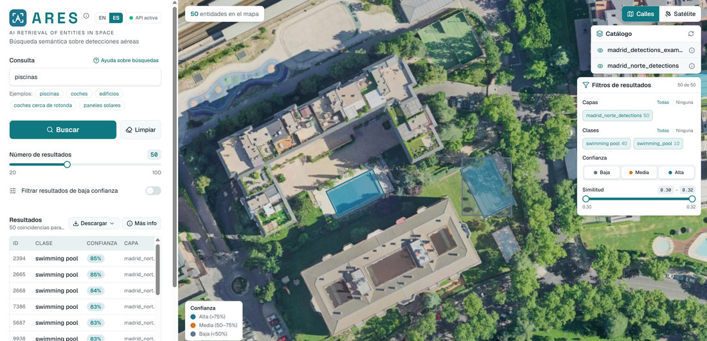
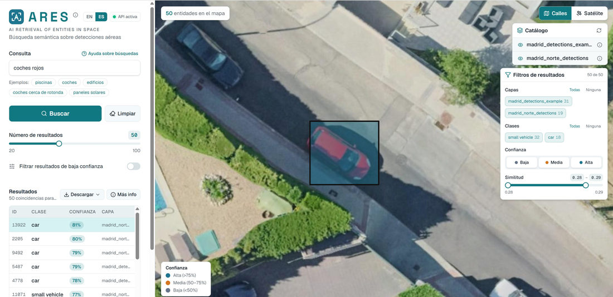
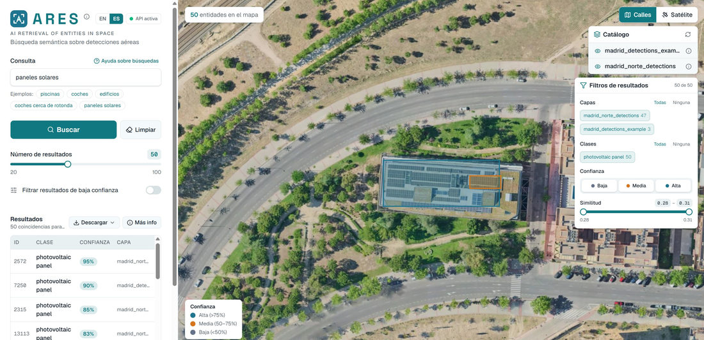
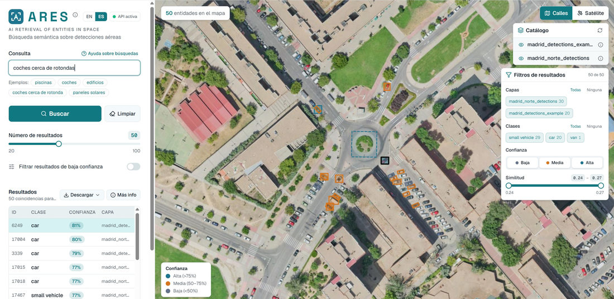

# Resultados

> No se pretende una evaluación científica formal (precision/recall por tipo de consulta).  
> Este capítulo **ilustra el comportamiento** del sistema sobre el dataset de prueba de Madrid, con capturas del visor de producto y comentarios cualitativos.

Escenario de las pruebas mostradas:

- Índice cargado en PostgreSQL (capas `madrid_norte_detections` y/o `madrid_detections_example`).
- API local + frontend Next.js.
- Consultas en español; `top_k` típico **50**.
- Vista **satélite** en OpenLayers; geometrías coloreadas por confianza del detector.

Las figuras de este capítulo son **reducciones** de capturas de alta resolución (ancho máximo ≈ 1100 px) para no inflar el repositorio ni la lectura en GitHub.

---

## Panorama de resultados en el visor

Tras `POST /search`, el frontend muestra:

1. **Tabla** — id, clase YOLO, confianza, capa.
2. **Mapa** — polígonos georreferenciados; leyenda Alta / Media / Baja confianza.
3. **Filtros cliente** — capas, clases, confianza, rango de similitud CLIP.
4. **Interpretación** (*Más info*) — intent, *target*/*reference*, texto CLIP, `source`, *timings*.

El resto del capítulo recorre consultas representativas del diseño (clase, atributo vía CLIP, especialista de dominio, espacial).

---

## Consultas de ejemplo

| Consulta | Modo esperado | Qué se observa en las pruebas |
|----------|---------------|-------------------------------|
| `piscinas` | Híbrida / clase (`search_class`); a menudo **parser** sin LLM | Clase `swimming pool` / `swimming_pool`, confianzas altas |
| `coches rojos` | Híbrida: filtro vehículos + ranking CLIP por color | Clases `car` / `small vehicle`; el mapa destaca vehículos de apariencia rojiza |
| `paneles solares` | Híbrida sobre clase fotovoltaica | Clase `photovoltaic panel`; footprints sobre cubiertas |
| `coches cerca de rotondas` | Espacial (`search_spatial` / `near`) | Vehículos en torno a rotonda; capa/referencia espacial visible |

---

## Caso 1 — Búsqueda por clase: «piscinas»

Consulta inequívoca respecto al catálogo. En el camino feliz el **parser determinista** resuelve la intención (`source=parser`, `llm_ms=0`) y la BD filtra por clases de piscina, ordenando por similitud CLIP del texto «piscinas» (o canónico equivalente).

*Figura 6.1 — «piscinas»: ~50 entidades; tabla dominada por `swimming pool` con confianza ≈ 83–85 %; bounding boxes sobre vasos en manzana residencial (Madrid norte).*

**Lectura cualitativa**

- El especialista `swimming-pool-detector` del pipeline offline se refleja en clases recuperables en consulta.
- Coexisten etiquetas `swimming pool` y `swimming_pool` en filtros: vocabulario heterogéneo de modelos, mitigado en UI por filtros de clase y por el catálogo de la API.
- Similitud CLIP en un rango estrecho (~0,30–0,32 en la captura): ranking semántico coherente dentro de la misma clase.

---

## Caso 2 — Clase + atributo (CLIP): «coches rojos»

Aquí el valor de la búsqueda **híbrida** es explícito: el SQL acota a clases de vehículo; CLIP ordena por parecido al texto que incluye el color. No existe columna `color=rojo` en la BD.

*Figura 6.2 — «coches rojos»: 50 resultados (`car` / `small vehicle`); en el mapa, vehículo rojo seleccionado con caja destacada; filtro de similitud ~0,28–0,29.*

**Lectura cualitativa**

- Demuestra el puente multimodal: atributo no tabulado → ranking vectorial.
- Mezcla `car` y `small vehicle` (VisDrone / taxonomías distintas): el usuario filtra por clase en cliente si quiere un subconjunto.
- No es un clasificador de color certificado; es **recuperación por similitud**. Pueden aparecer falsos positivos cromáticos según iluminación del crop —limitación ya anunciada en la introducción.

---

## Caso 3 — Especialista de dominio: «paneles solares»

Consulta alineada con el peso `yolo-remote-sensing-photovoltaic`. Sin ese modelo en el indexado offline, la clase no existiría en el índice.

*Figura 6.3 — «paneles solares»: clase `photovoltaic panel`; confianzas elevadas (hasta ~95 %); cajas azul/naranja sobre arrays en cubierta; fusión multi-capa (p. ej. 47 + 3 entidades).*

**Lectura cualitativa**

- Confirma el diseño multi-modelo del capítulo 04: un detector genérico urbano no habría aportado esta clase con la misma calidad.
- La leyenda de confianza separa detecciones altas vs medias sobre el mismo tejado —útil para QA visual antes de un uso operativo.
- Multi-capa: la API fusiona catálogo; el visor permite desactivar capas en filtros.

---

## Caso 4 — Consulta espacial: «coches cerca de rotondas»

Intent `search_spatial` con relación `near`: CLIP embebe el *target* (vehículos); PostGIS aplica `ST_DWithin` respecto a la *reference* (rotonda / infraestructura asociada en catálogo).

*Figura 6.4 — «coches cerca de rotondas»: vehículos alrededor de una rotonda urbana; clases `small vehicle` / `car` / `van`; referencia espacial marcada en el mapa (área discontinua).*

**Lectura cualitativa**

- El resultado no es «todos los coches de la capa», sino un subconjunto **condicionado por proximidad**.
- La UI muestra la zona de referencia además de los targets —trazabilidad de la interpretación espacial.
- El radio por defecto (50 m, configurable hasta 500 m) condiciona el cardinal de resultados; ampliar distancia en API/overrides cambia el conjunto sin reindexar.

---

## Síntesis de lo observado

| Dimensión | Observación en las pruebas |
|-----------|----------------------------|
| Cobertura de clases | Piscinas, vehículos, paneles solares recuperables tras indexado multi-modelo |
| Atributos visuales | Color vía CLIP funciona como ranking, no como filtro duro SQL |
| Espacial | `near` produce concentraciones coherentes en mapa + referencia visible |
| UX | Tabla + mapa + filtros permiten auditar confianza y similitud sin salir del visor |
| Catálogo | Varias capas simultáneas; el usuario acota en cliente |
| Limitaciones vistas | Vocabulario de clases duplicado (`swimming pool` vs `swimming_pool`); similitud CLIP en bandas estrechas; calidad acotada a lo detectado offline |

En conjunto, los ejemplos respaldan el objetivo del sistema: **explorar detecciones georreferenciadas con frases naturales**, con interpretación y geometría comprobables en el mismo pantallazo.

---

## Tiempos de respuesta (órdenes de magnitud)

La API expone `metadata.timings`: `llm_ms`, `clip_ms`, `database_ms`, `total_ms`. No se publica aquí un banco de carga formal; sí los **órdenes de magnitud** observados en el laboratorio local (CPU, índice de prueba Madrid, Ollama local).

| Tramo | Camino típico | Orden de magnitud |
|-------|---------------|-------------------|
| `llm_ms` | Parser / override (`piscinas`, muchas espaciales inequívocas) | **0 ms** |
| `llm_ms` | Ollama `llama3.2:3b` en CPU (consulta ambigua, caché miss) | **~1–5 s** (variable; cold start mayor) |
| `llm_ms` | Misma consulta ambigua, caché hit (`source=cache`) | **≈ 0 ms** (lookup en memoria; sin Ollama) |
| `clip_ms` | Un embed de texto ViT-B/32 | **~50–300 ms** en CPU (menos si el modelo ya está en memoria) |
| `database_ms` | Híbrida o espacial con HNSW + GIST, `top_k` ≤ 100 | **~50–500 ms** según cardinalidad y capas |
| `total_ms` | Fast-path (sin LLM) | **~0,2–1 s** extremo a extremo API |
| `total_ms` | Con LLM en CPU (miss) | **~1–6 s** (dominado por Ollama) |
| `total_ms` | Consulta ambigua repetida (hit LRU) | Orden del fast-path (CLIP + BD) |

Implicaciones de diseño ya contrastadas en uso:

1. El **fast-path** no es cosmética: convierte consultas frecuentes en latencia de índice, no de LLM.
2. La caché LRU (`CachingQueryAnalyzer`, `LLM_CACHE_MAXSIZE`) evita re-invocar Ollama cuando la misma frase normalizada (y modelo) ya se interpretó; el GeoJSON marca `source=cache`. Se inspecciona o vacía con `GET`/`DELETE /cache/llm`.
3. El coste YOLO/CLIP de indexado **no** entra en estos *timings*: ya está amortizado offline.

Para cifras exactas en un entorno dado, basta inspeccionar `metadata.timings` en la respuesta o el modal *Más info* del frontend tras cada búsqueda.

---

## Alcance de la evidencia

Lo mostrado es **demostración cualitativa** sobre un AOI de prueba, no un informe de métricas IR:

- No se reportan precision@k / recall por consulta etiquetada.
- No se comparan backends LLM ni umbrales CLIP de forma sistemática.
- Las capturas corresponden a un momento concreto del índice (pesos, capas y datos pueden evolucionar).

Sí permiten, en una memoria técnica de entrega, **verificar visualmente** que clase, atributo semántico y proximidad espacial se comportan como se diseñó en los capítulos 04 y 05.

---

## Resumen del capítulo

Sobre el índice de Madrid, ARES recupera de forma usable consultas de clase (`piscinas`), clase+atributo (`coches rojos`), dominio energético (`paneles solares`) y espacial (`coches cerca de rotondas`), con evidencia cartográfica y tabular en el visor. Los tiempos de consulta se mantienen en el rango interactivo gracias al índice materializado, al fast-path sin LLM y a la caché LRU en repeticiones ambiguas; el coste dominante, cuando aparece, es la interpretación Ollama en CPU (caché miss).
